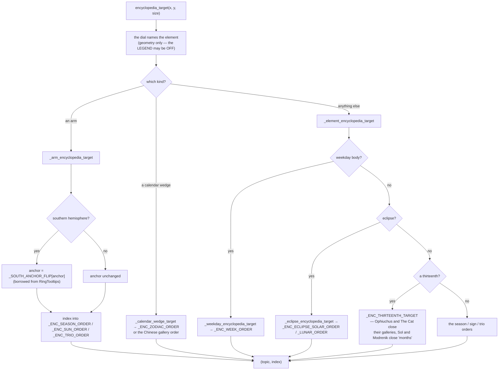

# Encyclopedia Targets — Flow

**About:** [description](../__about/encyclopedia_targets.md)

## Sections

```
📁 encyclopedia_targets.py
  THE DOOR'S BODY  encyclopedia_target
                    ├─ _element_encyclopedia_target ─┬─ _weekday_encyclopedia_target
                    │                                ├─ _eclipse_encyclopedia_target
                    │                                └─ _season_topic_index
                    ├─ _arm_encyclopedia_target ────── _sun_topic_index
                    └─ _calendar_wedge_target
  ORDER TABLES     _ENC_ZODIAC_ORDER, _ENC_WEEK_ORDER, _ENC_SEASON_ORDER,
                   _ENC_SUN_ORDER, _ENC_TRIO_ORDER,
                   _ENC_ECLIPSE_SOLAR_ORDER, _ENC_ECLIPSE_LUNAR_ORDER
  THE THIRTEENTHS  _ENC_OPHIUCHUS_INDEX, _ENC_CAT_INDEX, _ENC_SOL_INDEX,
                   _ENC_MODRENIK_INDEX → _ENC_THIRTEENTH_TARGET
```

## Element → (topic, index)



Pseudocode:

    encyclopedia_target(x, y, size):
        element <- self._dial.element_at(x, y, size)     # geometry, not text
        FOR resolver IN (_arm_encyclopedia_target,
                         _calendar_wedge_target,
                         _element_encyclopedia_target):
            hit <- resolver(element)
            IF hit is not None: RETURN hit
        RETURN None

**It answers with the legend OFF.** That is the behavioural line between
this family and the other three: turn hovers off and every tooltip goes
silent, while the Spacebar jump still opens the right page — because
nothing here builds text.
