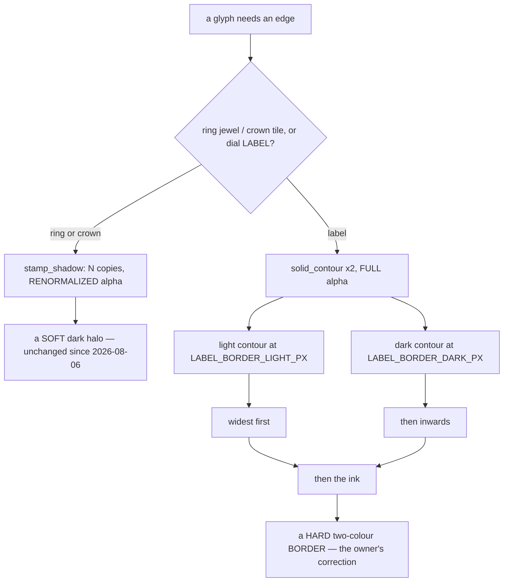
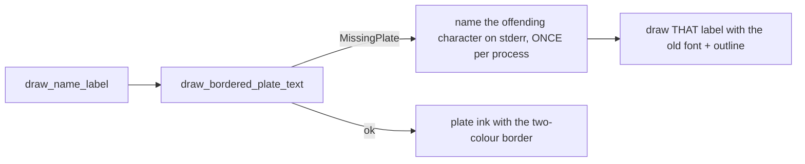

# Glyph Shadow — Flow

**About:** [description](../__about/glyph_shadow.md)

## Two edges, one module

## How a label is built

Pseudocode:

    FUNCTION bordered_plate_text(text, height_px, metal, dpr):
        ink_px = height_px * PLATE_INK_HEIGHT_FRACTION * dpr   # plate has no em slack
        IF cached(text, ink_px, metal, dpr): RETURN it

        glyphs = letter_plates.plate_text_pixmap(text, ink_px, metal)  # RAISES if plateless
        dark_px  = LABEL_BORDER_DARK_PX  * dpr        # device px, not a fraction
        light_px = LABEL_BORDER_LIGHT_PX * dpr

        light = solid_contour(glyphs, light_px, SHADOW_STAMP_TINT_LIGHT)
        dark  = solid_contour(glyphs, dark_px,  SHADOW_STAMP_TINT)

        tile = blank(light.size)
        draw light   at 0,0                  # widest
        draw dark    centred                 # then inwards
        draw glyphs  centred                 # then the ink
        RETURN tile stamped with dpr

    FUNCTION solid_contour(glyphs, radius_px, color):
        silhouette = glyphs' alpha filled flat with color
        FOR EACH of shadow_sample_count(radius_px) angles:
            draw silhouette offset by radius_px in that direction   # alpha 1.0
        # full opacity => the union is a hard dilation, not a cushion

The two `solid_contour` calls and their ORDER are the design: the light
band survives only as the ring OUTSIDE the dark keyline, which is what
makes one label legible on both a near-black body and a near-white one.

## And when there is no plate

Measured: 881 of 881 figure display stems compose from plates, as do all
the weekday labels. Exactly one string in the program takes the `C -> D`
road — the archetype centre "The Lord's Day", which needs an apostrophe
the library does not have.
