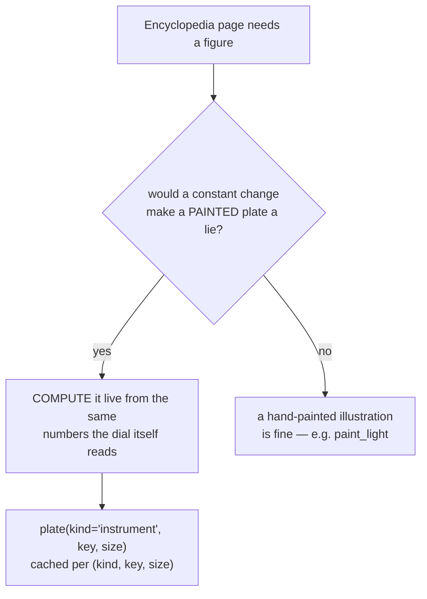

# Instrument Diagrams — Flow

**About:** [description](../__about/instrument_diagrams.md)

## The derivation check (root Rule #19), applied to a page

## One dispatcher, twelve drawers

    FUNCTION plate("instrument", key, size):
        drawer = { "dial": _dial, "solar_rotation": _solar_rotation,
                   "twilight": _twilight, "year_wheel": _year_wheel,
                   "moon_lunations": _moon_lunations, "metals": _metals,
                   "ring_jewels": _ring_jewels, "ring_presets": _ring_presets,
                   "pointers": _pointers, "world_modes": _world_modes,
                   "oscillations": _oscillations, "chi": _chi }[key]
        RETURN drawer(key, size)          # each reads its own live config/core numbers

Every drawer shares the same canvas/font/pen helpers (`_canvas`, `_font`,
`_pen`, `_on_dial`, `_text`, `_caption`) so the twelve pages read as one
family despite covering unrelated subsystems (angles, twilight,
seasons, moon, metals, ring jewels, orbital mechanics) — `_chi` is the
one exception: it skips the sketch helpers entirely and composes the
real ring plate.

## The three ROW figures — one WIDE row, one tile per table row

    FUNCTION _ring_presets / _pointers / _world_modes (size):
        row = _Row(kind, size)                    # the whole geometry, derived
            height = size / aspect                # ...the plate is WIDE
            pitch  = size / columns               # ...one row, evenly spaced
            radius = whatever the margins, the label stack
                     and the caption band LEAVE OVER
        canvas(size, size / row.height)
        FOR EACH item IN the program's OWN table: # ring_presets() / POINTER_* / WORLD_MODES
            centre = row.center(index)
            draw the item                         # seats / arms / wedges / strip / star
            _tile_labels(centre, row, its name, its count)
        _caption(what the numbers mean)           # wraps, and shrinks to fit its band

The aspect is the point: the reader can only ever grant a figure ~45% of
the viewport HEIGHT, so a SQUARE master arrived 208 px wide in a 1123 px
column. Shaped like the space it is given, the same figure is bound by
the WIDTH instead and arrives four to five times larger.

`_world_modes` is the same row with two tiles: it asks `core.world` for
both numbers at the project's own golden tilt, so the figure is the
program's arithmetic rather than a sketch of it — one dial shows
`star +10.76° / world 0°`, the other `star 0° / world -10.76°`, and true
solar noon lands under the star's top arm in both.

## `_chi`'s own path — composed, not sketched

    FUNCTION _chi(key, size):
        outer = BandSpec(band="outer", pixels=size, jewel_hours=(24,), ...)
        blit band_plate(outer)                      # render.numeral_bands — the
                                                      # SAME cache the dial reads
        WITH paths.display(metal_shades={"thematic": RING_THEMATIC_SHADES["CHI"]}):
            glyph = shared_cache().pixmap_by_height(X.png, height, metal="thematic")
        stamp glyph at ring_position_angle(24), rotated readable_rotation_deg(24)
        RETURN pixmap

`shared_cache()` is called directly (never `jewel_metal_file`'s
deferred door) — a plate built once and cached forever must never
freeze on the GOLD fallback a cold background warm-up would otherwise
leave it on.
