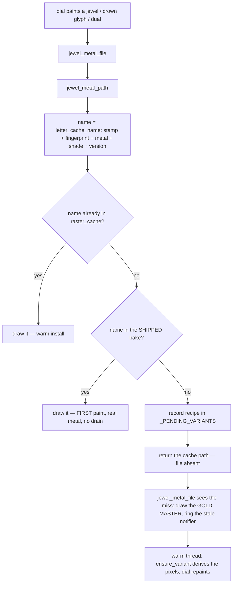
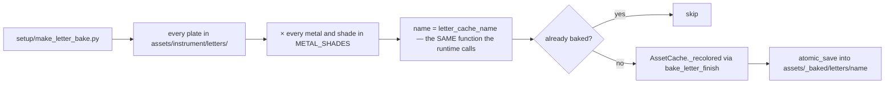

# Letter Bake — Flow

**About:** [description](../__about/letter_bake.md)

## What a dial asks for, and where it lands

The `G -- yes` branch is the whole point. Before the bake, a cold
install took the `I → J → K → L` road for **every** letter on the dial:
a gold stand-in first, then a numpy recolor per plate on the warm
thread, then a repaint. After it, the first paint is already correct.

Pseudocode:

    FUNCTION jewel_metal_path(master, metal):
        master = art_file(master)
        IF master missing: RETURN master
        shade = metal_shade(metal)                # the watch's display context
        name  = letter_cache_name(master, metal, shade)   # THE one naming function
        cache = raster_cache / name

        IF NOT cache.exists():
            baked = letter_bake.baked_file(name)  # dict hit, folder listed once
            IF baked IS NOT None:
                RETURN baked                      # <-- no recipe recorded
        record _PENDING_VARIANTS[cache] = (master, metal, gold, alpha, shade)
        RETURN cache

## How the bake is produced

Pseudocode:

    FUNCTION bake(force=False):
        FOR EACH master IN letter plates:
            FOR EACH metal, shades IN METAL_SHADES:
                FOR EACH shade IN shades:
                    name = letter_cache_name(master, metal, shade)
                    IF (bake_dir/name).exists() AND NOT force: CONTINUE
                    bake_letter_finish(master, metal, shade, bake_dir/name)

    # (metal, shade) pairs collapse onto RAMPS — gold/classic and
    # thematic/gold are the same ramp — but they are NOT deduplicated
    # here, because the runtime key carries the pair, not the ramp.
    # Two names, identical pixels, a few MB. Deduplicating them would
    # mean this file knowing the ramp table, which is the one thing
    # the "name IS the manifest" design refuses to know.

The `E -- yes` skip is what makes re-running the baker after adding a
single new plate cost a single plate.
