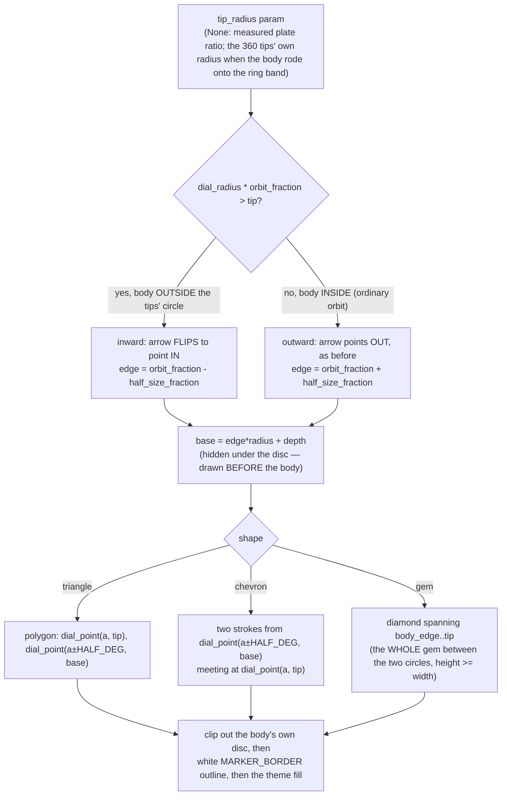

# Marker Marks — Flow

**About:** [description](../__about/marker_marks.md)

## The pointer's three shapes (`draw_pointer`)

Every vertex is a `dial_point(angle, radius)` — the mark rides the
body's own angle on the circle, never a fixed screen "up".

## The four stations (`draw_station_mark`)

    FUNCTION draw_station_mark(style, station):
        SWITCH style:
          uniform      -> the one silver halo, identical at all four   # what shipped
          arc_grammar  -> birth  : a dashed seed ring
                          youth  : an arc opening on the waxing side
                          zenith : a full corona of radial rays
                          age    : the arc closing from the other side
          inner_glow   -> outer, inner = MOON_STATION_GLOW[station]
                          draw the halo at a CONSTANT radius, alpha *= outer
                          IF inner > 0:
                              clip to moon_face.dark_region(...)        # only the unlit half glows
                              draw an inward gradient, alpha *= inner

The Sun's twin adds two more styles: `uniform_seasonal` takes the same
halo in `palette.INSTRUMENT_SEASON_COLORS[season]`, and
`day_night_wedge` fills a ring arc to the day's own length.

## The solar eclipse (`draw_solar_eclipse`)

    FUNCTION draw_solar_eclipse(style, state, magnitude):
        IF style == "halo": RETURN            # the caller already drew it
        IF style == "magnitude_arc":
            draw the body, then a ring gauge filled clockwise to magnitude
            RETURN
        # "bite" (owner correction 2026-08-11) — drawn AS SEEN, on top
        # of config.defaults.ECLIPSE_SOLAR_ART (the owner's own icon)
        IF state == "solar_total" AND covered >= 1.0:
            RETURN                              # the icon alone is the look
        IF state == "solar_annular":
            draw the ring of fire around the black disc
        ELSE:
            visible = 1 - covered
            phase = acos(1 - 2*visible) / (2*pi)      # invert moon_lit_region's own mapping
            draw moon_lit_region(phase, radius) as a bright crescent  # the SAME terminator the Moon's phases use
