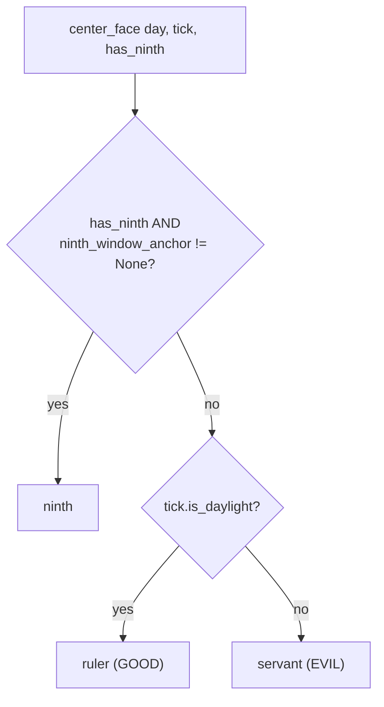

# Ninths — Flow

**About:** [description](../__about/ninths.md)

## The center face, right now (`center_face`)

    FUNCTION ninth_window_anchor(day, tick):
        noon_angle = time_to_dial_angle(day.sun.noon)          # SOLAR, not wall-clock
        IF |hours_between(tick.hour_angle, noon_angle)| <= CENTER_WINDOW_HOURS:
            RETURN "noon"
        midnight_angle = (noon_angle + 180) % 360
        IF |hours_between(tick.hour_angle, midnight_angle)| <= CENTER_WINDOW_HOURS:
            RETURN "midnight"
        RETURN None

## The active thirteenth (`active_thirteenth`)

    FUNCTION active_thirteenth(skin, day):
        IF skin.pointer != "calendar": RETURN None    # Calendar-only seat
        candidates = day.thirteenth_candidates          # today's FACT set
        mount = CALENDAR_MOUNTS.get(skin.calendar_mount)
        key = mount.centre IF mount names one
              ELSE (Ophiuchus if zodiac wheel ELSE Sol)  # the wheel's own default
        RETURN key IF key IN candidates ELSE None

A mount's own named thirteenth always OUTRANKS the wheel's default
whenever both are active settings at once.
