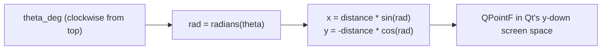

# Painting — Flow

**About:** [description](../__about/painting.md)

## The dial → Qt angle conversion

The project measures angles CLOCKWISE from the dial TOP (12 o'clock);
Qt measures COUNTERCLOCKWISE from 3 o'clock. Every point/pie in this
folder funnels through one formula:

Pseudocode:

    FUNCTION dial_point(theta_deg, distance):
        rad = radians(theta_deg)
        RETURN (distance * sin(rad), -distance * cos(rad))

    FUNCTION draw_pie(radius, start_deg, end_deg):
        qt_start = (90 - start_deg) * 16          # Qt's 1/16-degree units
        qt_span  = -(end_deg - start_deg) * 16     # negative = clockwise
        drawPie(rect, qt_start, qt_span)

## The tritone gray map (`tinted_gray`)

    FUNCTION tinted_gray(value 0..255, tint):
        IF tint is None: RETURN plain gray(value)
        hue = QColor(tint)
        FOR EACH channel c IN (hue.r, hue.g, hue.b):
            IF value <= 127: channel = c * (value*2) / 255       # black -> tint
            ELSE:             channel = c + (255-c)*(value*2-255)/255  # tint -> white
        RETURN QColor(channels)
