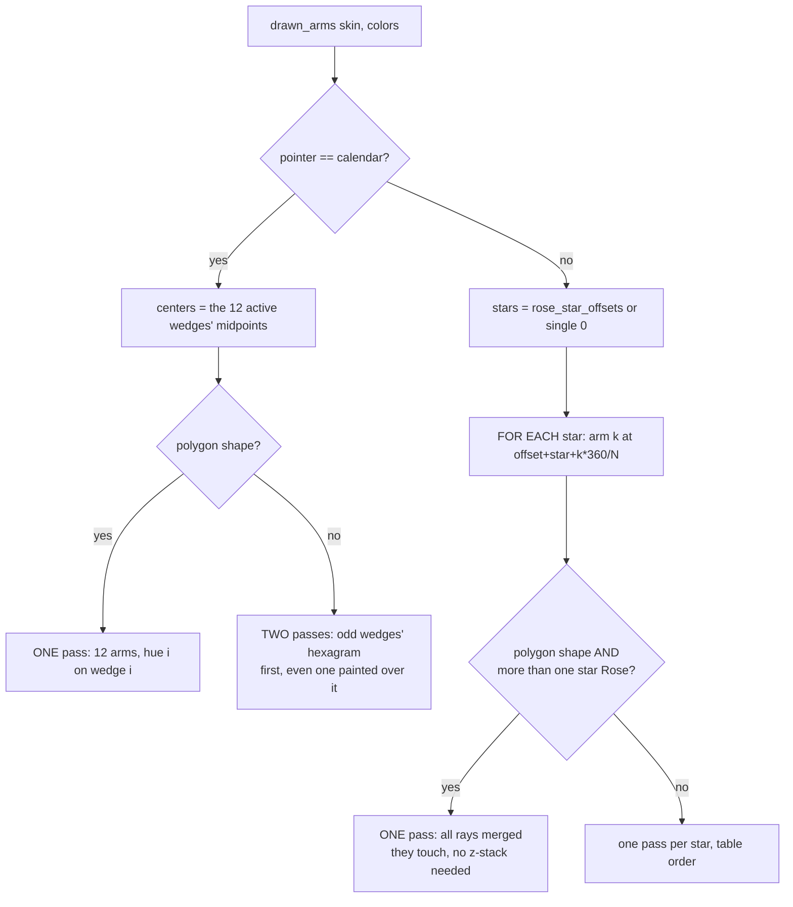

# Shapes — Flow

**About:** [description](../__about/shapes.md)

## The drawn wheel (`drawn_arms`)

## The curved polygon edge (`_append_edge` / `_pulled_midpoint`)

    FOR EACH outer edge of the figure:
        mid    = chord midpoint of the straight edge
        target = the pointer's OWN star inner radius
        mid'   = mid pulled along ITS OWN radius toward target,
                 by the curvature fraction (0 -> mid, 1 -> target)
        IF edge_mode == "notched":
            draw two straight segments meeting at mid'
        ELSE ("smooth"):
            draw one quadratic curve whose CONTROL point is 2*mid' - chord_mid
            (so the CURVE, not the control point, passes through mid')

At curvature 0 both modes collapse to the plain straight polygon edge;
at curvature 1 the smooth hexagon becomes the hexagram.
