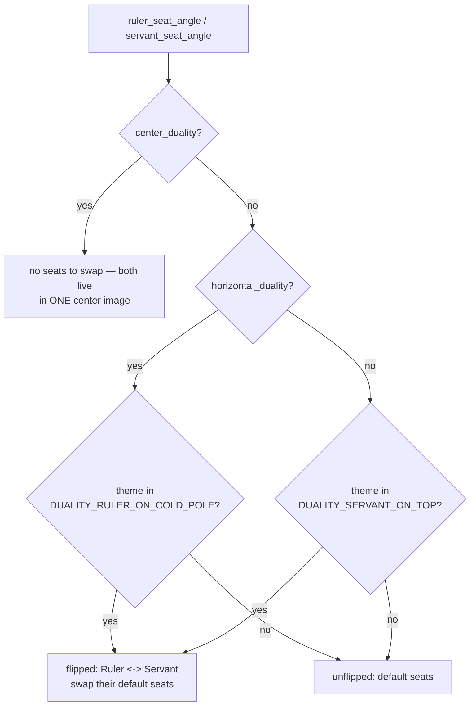

# Skin Geometry — Flow

**About:** [description](../__about/skin_geometry.md)

## The Sunday duality seat resolution

The trickiest chain in this module: which arm the Ruler and Servant
each stand on, given a wheel's own axis and a theme's own flip.

Pseudocode:

    FUNCTION ruler_seat_angle(skin):
        IF _duality_flipped(skin): RETURN servant's DEFAULT seat
        ELSE:                      RETURN ruler's DEFAULT seat

    FUNCTION _duality_flipped(skin):
        IF center_duality(skin): RETURN False        # nothing to swap
        IF horizontal_duality(skin):
            RETURN skin.weekday_theme in DUALITY_RULER_ON_COLD_POLE
        RETURN skin.weekday_theme in DUALITY_SERVANT_ON_TOP

The two faces swap ARMS only — never their names, plates or articles.
`weekday_slots(skin)` then applies THREE transforms in order: the
wheel's own arm offset, a center-duality pull (removes "sun" from every
seat), and — if flipped — relocates the Sun alone onto the Servant's
default seat (his slot-mates keep their arm).
