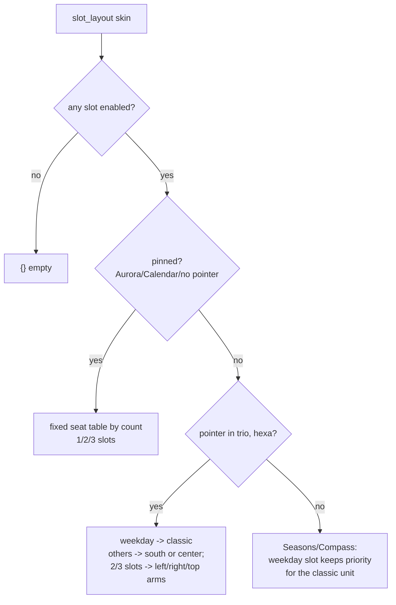

# Slot Layout — Flow

**About:** [description](../__about/slot_layout.md)

## The slot position matrix (`slot_layout`)

Pseudocode (the 1-slot branch, the simplest full path):

    FUNCTION slot_layout(skin):
        slots = enabled_slots(skin)
        IF slots is empty: RETURN {}
        IF pinned (Aurora/Calendar/no pointer):
            RETURN the fixed seat table for len(slots)
        IF pointer in (trio, hexa):
            IF one slot:
                IF its mode == weekday: RETURN {index: "classic"}
                RETURN {index: south-seat (trio) or "center" (hexa)}
            ... # 2/3-slot branches seat the pair/trio on fixed arms
        ELSE:  # cross, octa — the weekday unit keeps priority
            IF one slot: RETURN "classic" if weekday else "center"
            ... # 2/3-slot branches flank the classic unit

## The Sunday duality split

    GIVEN a theme's dual asset exists, EXACTLY ONE of:
        sunday_dual_face(skin)  -> the Servant holds his OWN seat
                                    (Compass / Seasons / Rose)
        center_dual_face(skin)  -> the duality lives in ONE center image
                                    (Trinity / Prism / center_only mode)
    is true — never both, never neither.
