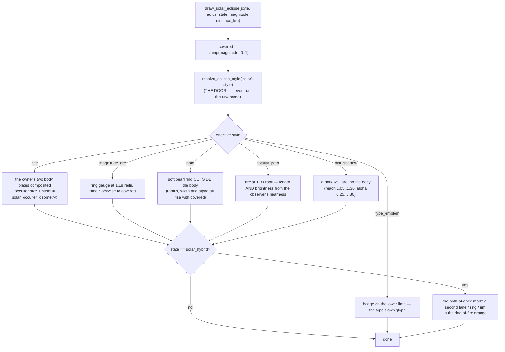

# Solar Eclipse — Flow

**About:** [description](../__about/solar_eclipse.md)

## One door, six pictures (`draw_solar_eclipse`)

## The totality path's one honest number (`totality_path_reach`)

    FUNCTION totality_path_reach(covered, distance_km):
        IF distance_km IS NULL:
            # No observer, or a catalog row with no ground point.
            # The catalog magnitude is the eclipse's GREATEST magnitude
            # somewhere on Earth — it is what is on offer, never what
            # THIS observer gets. So it is an ESTIMATE and the caller
            # draws it DASHED.
            RETURN clamp(covered, 0, 1), measured = FALSE
        # The real quantity: the observer's great-circle distance to the
        # catalog's greatest-eclipse ground point, already on the event.
        # NOT the distance to the nearest point of the central PATH —
        # the catalog holds one point, not the track — so this
        # UNDER-reads for an observer far along the path. Under is the
        # safe direction; over would be a lie.
        RETURN clamp(1 - distance_km / ECLIPSE_SOLAR_VISIBILITY_KM, 0, 1),
               measured = TRUE

    FUNCTION _totality_path(state, covered, distance_km):
        reach, measured = totality_path_reach(covered, distance_km)
        span  = max(MIN_SPAN_DEG, reach * 360)        # LENGTH  = nearness
        alpha = ALPHA_MIN + reach * (ALPHA_MAX - ALPHA_MIN)   # BRIGHTNESS too
        width = ARC_WIDTH; IF state is partial: width *= PARTIAL_WIDTH
        IF state == solar_hybrid:
            outer lane, span/2, centred at the TOP,    corona pearl
            inner lane, span/2, centred at the BOTTOM, ring-of-fire orange
        ELSE:
            one lane, full span, centred at the TOP, _totality_light(state)
        # every lane DASHED when measured is FALSE — the estimate, said aloud

## The type emblem (`_type_emblem`)

    FUNCTION _type_emblem(state):
        stamp a night backing disc on the body's lower limb
        SWITCH state:
          solar_total   -> a FILLED disc      # nothing of the Sun is left
          solar_partial -> a filled disc MINUS an offset disc-sized bite
          solar_annular -> ONE ring           # the ring of fire
          solar_hybrid  -> the same ring, plus a SECOND inside it

    # One grammar: how much of the emblem's centre is open says how much
    # of the Sun survives.
