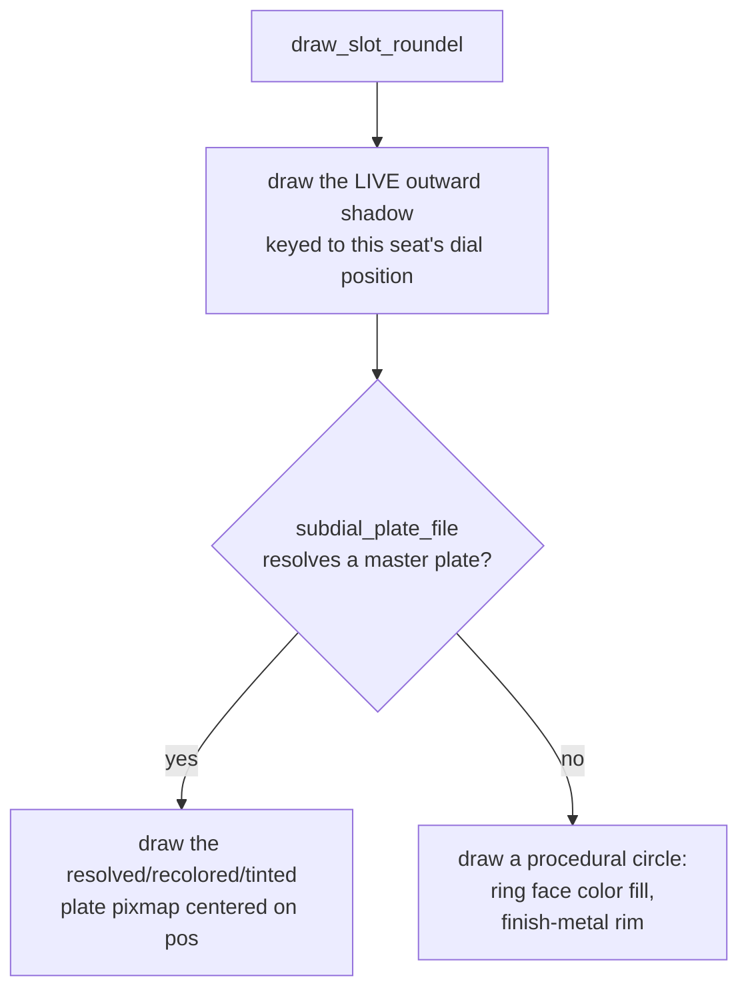

# Subdial — Flow

**About:** [description](../__about/subdial.md)

## The plate resolution chain (`draw_slot_roundel`)

Pseudocode:

    FUNCTION draw_slot_roundel(pos, diameter):
        draw_subdial_shadow(pos, diameter)     # always, seat-relative offset
        plate = subdial_plate_file(finish, tint if style == "theme" else None)
        IF plate exists:
            draw_pixmap_centered(plate, pos, diameter)
        ELSE:
            draw procedural circle: fill = ring_face_color, rim = finish metal

## Fit-to-width text (`draw_fitted_text` / `draw_two_lines`)

    FUNCTION draw_fitted_text(pos, slot_size, text):
        measure text at a reference font size
        scale font size so measured width == slot_size * TIME_TEXT_WIDTH_FRACTION
        floor at BODY_LABEL_MIN_PX
        draw_shadowed_text(pos, text, font, finish_color)

Two-line variant measures the WIDER of its two lines once, so both
lines share one font size and stack at a fixed vertical offset.
