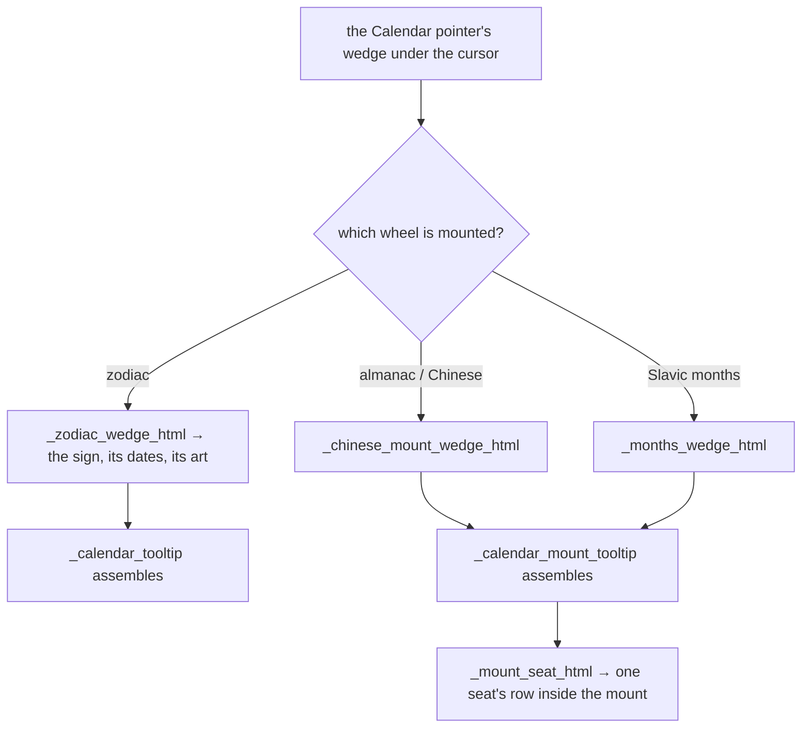
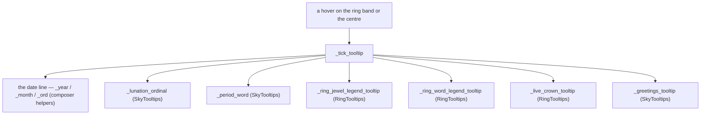

# Calendar Tooltips — Flow

**About:** [description](../__about/tooltip_calendar.md)

## Sections

```
📁 tooltip_calendar.py
  THE WEDGES   _calendar_tooltip, _zodiac_wedge_html, _months_wedge_html,
               _chinese_mount_wedge_html
  THE MOUNTS   _mount_seat_html, _calendar_mount_tooltip
  THE WEEKDAY  _weekday_tooltip
  THE TICK     _tick_tooltip
  THE SIGNS    _zodiac_text, _zodiac_line, _zodiac_image_trio,
               _chinese_text, _ascendant_text
  MONTH NAMES  _MONTHS, _MONTHS_SHORT
```

## One wedge hover



## The tick readout — where the families meet



`_tick_tooltip` is the single strongest argument for the mixin shape:
it reaches into two other families and the composer's own helpers on one
call, and as a mixin every one of those is a plain `self.` — the same
lines it had before the cut.
