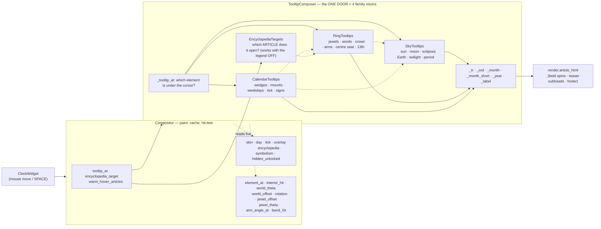

# Tooltip Composer — Flow

**About:** [description](../__about/tooltip_composer.md)

## The collaboration

The dotted arrows to `STATE` and `GEO` are the whole design. The composer
holds the DIAL, not a copy of its state, so a re-installed skin or a
fresh day context is visible on the very next call — and it asks the dial
for geometry rather than re-deriving angles, so a tooltip can never name
a different thing from the one the paint drew.

The dotted arrows BETWEEN the four families are why they are MIXINS and
not collaborators (owner's word, 2026-08-19). They are ordinary `self.`
calls — the ring's arm legend borrows the sky's season spans, the
calendar's tick readout borrows the ring's crown and the sky's greetings,
the targets borrow the ring's arm anchors. Four collaborators would have
been four holders of the same dial and a hand-built path for every one of
those arrows; as bases of one class there is still exactly ONE holder,
and not a single call site changed.

## One hover, end to end

    FUNCTION tooltip_at(x, y, size):            # on the Compositor
        RETURN self._tooltips.tooltip_at(x, y, size)

    FUNCTION TooltipComposer.tooltip_at(x, y, size):
        IF the dial has no day context yet: RETURN None
        IF the skin's legend is OFF:        RETURN None
        element = dial.element_at(point, radius, dial.rotation(), today)
        text    = the family builder for that element    # ~60 of them,
                                                         # inherited
        IF self.encyclopedia_target(x, y, size) is not None:
            text += article_html.learn_more_footer(self._tr)
        RETURN text

`encyclopedia_target(x, y, size)` walks the SAME dispatch and returns the
`(topic, entry)` pair instead of the text — which is what makes the
SPACE jump and the hover agree by construction rather than by care.
