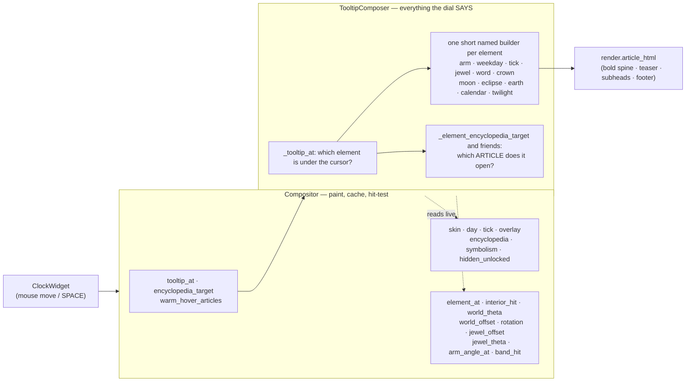

# Tooltip Composer — Flow

**About:** [description](../__about/tooltip_composer.md)

## The collaboration

The dotted arrows are the whole design. The composer holds the DIAL, not
a copy of its state, so a re-installed skin or a fresh day context is
visible on the very next call — and it asks the dial for geometry rather
than re-deriving angles, so a tooltip can never name a different thing
from the one the paint drew.

## One hover, end to end

    FUNCTION tooltip_at(x, y, size):            # on the Compositor
        RETURN self._tooltips.tooltip_at(x, y, size)

    FUNCTION TooltipComposer.tooltip_at(x, y, size):
        IF the dial has no day context yet: RETURN None
        element = dial.element_at(point, radius, dial.rotation(), today)
        text    = the builder for that element      # ~40 of them
        IF the element owns an Encyclopedia page:
            text += article_html.learn_more_footer(self._tr)
        RETURN text

`encyclopedia_target(x, y, size)` walks the SAME dispatch and returns the
`(topic, entry)` pair instead of the text — which is what makes the
SPACE jump and the hover agree by construction rather than by care.
