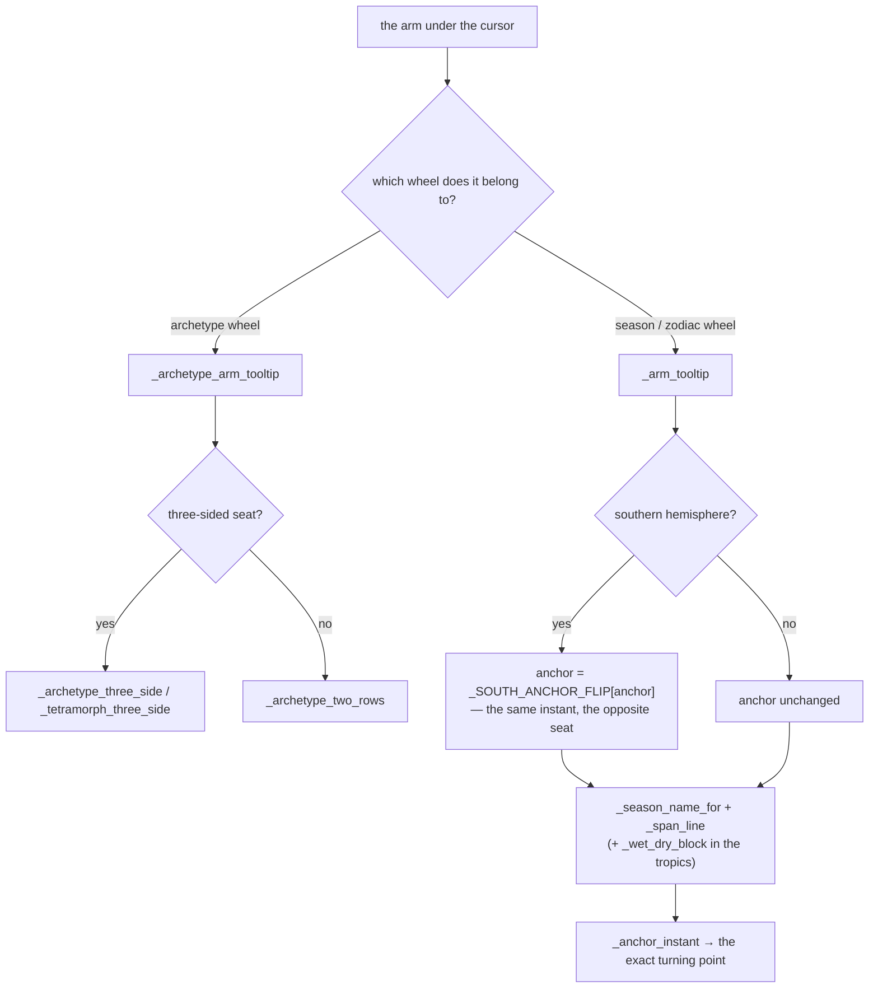
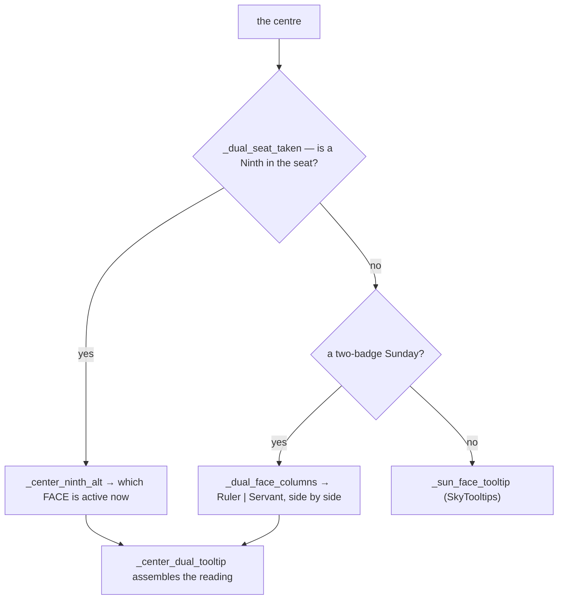

# Ring Tooltips — Flow

**About:** [description](../__about/tooltip_ring.md)

## Sections

```
📁 tooltip_ring.py
  THE BAND    _ring_jewel_legend_tooltip, _ring_word_legend_tooltip,
              _live_crown_tooltip, _crown_arc_centre
  THE ARM     _arm_tooltip, _SOUTH_ANCHOR_FLIP
  ARCHETYPES  _archetype_arm_tooltip ─┬─ _archetype_three_side
                                      ├─ _tetramorph_three_side
                                      └─ _archetype_two_rows
              _archetype_center_tooltip
  THE CENTRE  _center_dual_tooltip ─┬─ _dual_face_columns
                                    └─ _center_ninth_alt
              _dual_seat_taken
  THE 13th    _active_thirteenth, _thirteenth_tooltip
  SHARED KEY  _combo_key
```

## One arm hover



`_span_line`, `_wet_dry_block`, `_season_name_for` and `_anchor_instant`
live in [Sky Tooltips](../__about/tooltip_sky.md): a season arm and the
Earth marker say the same thing about the same sky, and they say it
through the same four helpers rather than two copies.

## The centre seat



`_combo_key(theme, roster)` is the one key `_weekday_tooltip`,
`_sun_face_tooltip` and `_dual_face_columns` all build their seat lookup
from — three families, one key, no third spelling of it.
