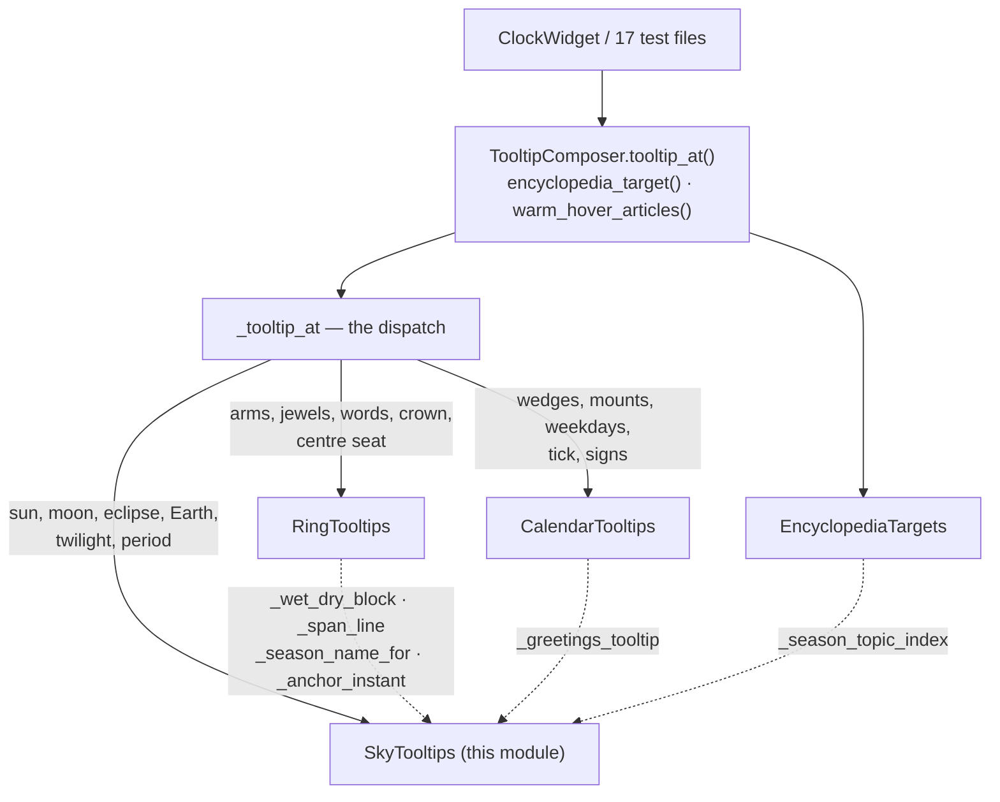
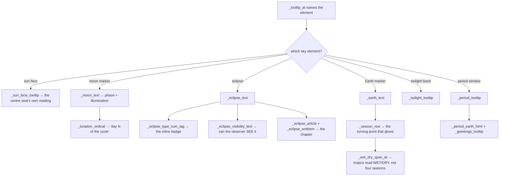

# Sky Tooltips — Flow

**About:** [description](../__about/tooltip_sky.md)

## The four families, and who calls into this one

The dotted arrows are why this is a MIXIN and not a collaborator: they
are `self.` calls that cost nothing here and would each need a
hand-built back-channel if every family held its own dial.

## Building one sky hover

Pseudocode:

    _earth_text():
        head  <- day/week ordinals + the date, through _ord/_month/_year
        row   <- _season_row()            # the event, while it glows
        key   <- _current_season_key()    # which season we are IN
        RETURN _label(head) + row

Every one of those helpers reads `self._dial.day` and
`self._dial.tick` live — the composer's single reference — so a new day
context can never leave a stale sentence behind.
