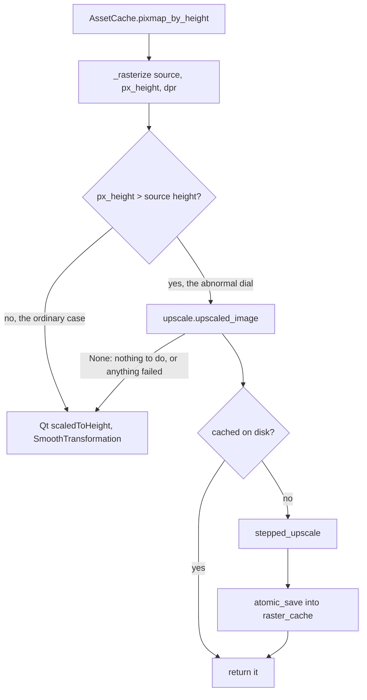
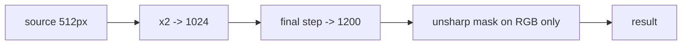
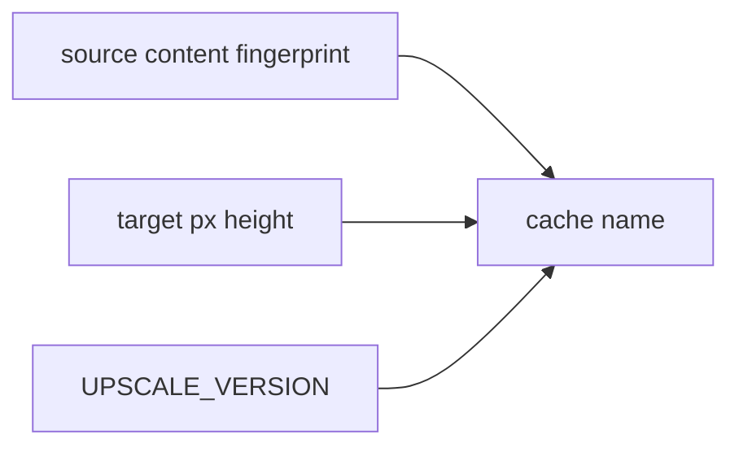

# Upscale — Flow

**About:** [description](../__about/upscale.md)

## Where it sits

The fallback arrow is the important one. A failure here costs the
picture the program would have drawn before this module existed — never
a blank element, never a raised error on the paint path.

## The algorithm

Pseudocode:

    FUNCTION stepped_upscale(image, px_height):
        IF px_height <= image.height: RETURN image      # we only go up
        WHILE image.height * 2 < px_height:
            image = image.scaledToHeight(image.height * 2, Smooth)
        image = image.scaledToHeight(px_height, Smooth)
        RETURN unsharp(image, amount=0.55, radius=1)

    FUNCTION unsharp(image, amount, radius):
        rgb, alpha = split(image)
        blurred = box_blur(box_blur(rgb, radius), radius)   # ~gaussian
        rgb = clip(rgb + amount * (rgb - blurred), 0, 255)
        RETURN join(rgb, alpha)          # ALPHA UNTOUCHED

Two decisions carry the whole thing:

- **Halving steps.** A bilinear pass that never stretches beyond 2×
  only ever mixes genuinely adjacent pixels. One 512→1200 leap mixes
  distant ones, which is what turns edges into ramps.
- **RGB only.** Sharpening ALPHA would ring the plate's own silhouette —
  a bright halo and a dark bite around every figure on the dial.

## Why the cache key looks like that

The same no-manifest design the letter bake uses: re-draw the art and
the fingerprint changes; change the algorithm and the version changes.
Either way the old file simply stops being the file anyone asks for, so
a stale upscale cannot be painted — it can only fail to save time.
