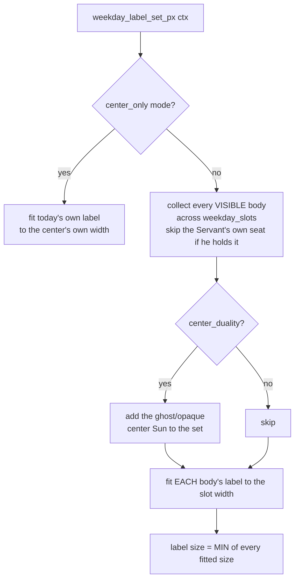

# Weekday Body — Flow

**About:** [description](../__about/weekday_body.md)

## The set-uniform label size

Pseudocode:

    FUNCTION weekday_label_set_px(ctx):
        IF display_mode == "center_only":
            RETURN name_label_px(today's label, center width)
        target_width = weekday_body_size(ctx) * NAME_LABEL_WIDTH_FRACTION
        bodies = { visible_occupant(seat) FOR EACH seat IN weekday_slots(ctx.skin)
                   EXCLUDING the Servant's own seat when he holds it }
        IF center_duality(ctx.skin): bodies.add("sun")
        RETURN MIN( name_label_px(label(b), target_width) FOR b IN bodies )

Two independent paint passes (`WeekdayLayer`, DAILY; `CenterBodyLayer`,
MINUTE) call this same pure function and always agree, because it reads
nothing but the skin and the day — never a stored, mutable "current
label size".
