# Archetype Layers — Flow

**About:** [description](../__about/archetype.md)

## Algorithm

```mermaid
%%{init: {'flowchart': {'subGraphTitleMargin': {'top': 0, 'bottom': 35}}}}%%
flowchart TB
    subgraph ARM["ArchetypeLayer.paint()"]
        A1[key = archetype_key] --> A2{key is None?}
        A2 -- yes --> A3[return: mode not active]
        A2 -- no --> A4[label_px = archetype_label_set_px, computed once]
        A4 --> A5[FOR EACH index, fig IN archetypes.figures]
        A5 --> A6{gate archetype:index?}
        A6 -- no --> A7[skip: hover lift owns it]
        A6 -- yes --> A8[lit = reveal_active OR index == archetype_lit]
        A8 --> A9{fig rotates?}
        A9 -- yes --> A10[resolve today's rotating art file]
        A9 -- no --> A11
        A10 --> A11[height = archetype_figure_size: circle or portrait]
        A11 --> A12[draw figure: full if lit else ghost_opacity]
    end
    subgraph CENTER["ArchetypeCenterLayer.paint()"]
        B1[key = archetype_key] --> B2{key None OR center None\nOR gate archetype:center fails?}
        B2 -- yes --> B3[return]
        B2 -- no --> B4[height = archetype_figure_size, hover-scaled]
        B4 --> B5[lit = reveal_active OR archetype_center_lit\nhour_angle within window of noon/midnight]
        B5 --> B6[opacity = 1.0 if lit else ghost_opacity]
        B6 --> B7{art_ready?}
        B7 -- yes --> B8[draw pixmap centered]
        B7 -- no --> B9[draw name label at set-uniform size]
    end
```

Pseudocode (language-neutral):

    # ArchetypeLayer — DAILY content, hover_variable (painted live)
    key = archetype_key(skin)
    IF key is None: RETURN                    # Archetype mode not active
    label_px = archetype_label_set_px(key, arm_width)   # once for the set
    FOR EACH (index, fig) IN archetypes.figures(key):
        element = f"archetype:{index}"
        IF NOT gate(element): CONTINUE          # hover z-lift owns it now
        lit = reveal_active OR index == archetype_lit
        IF fig declares "rotates": resolve today's rotating art sibling
        height = archetype_figure_size(skin, radius, fig.file)  # circle/portrait
        opacity = 1.0 IF lit ELSE weekday_set.ghost_opacity
        draw the figure at its arm position, height * hover_factor(element),
             opacity, named = (names_on AND lit)

    # ArchetypeCenterLayer — MINUTE, always live
    key = archetype_key(skin)
    center = archetypes.center(key)
    IF key is None OR center is None OR NOT gate("archetype:center"): RETURN
    height = archetype_figure_size(skin, radius, center.file) * hover_factor
    lit = reveal_active OR archetype_center_lit(hour_angle, star_rotation)
    opacity = 1.0 IF lit ELSE weekday_set.ghost_opacity
    IF art_ready(center.file):
        draw pixmap centered, at `opacity`
    ELSE:
        draw the centre's name label at the SAME set-uniform label size
