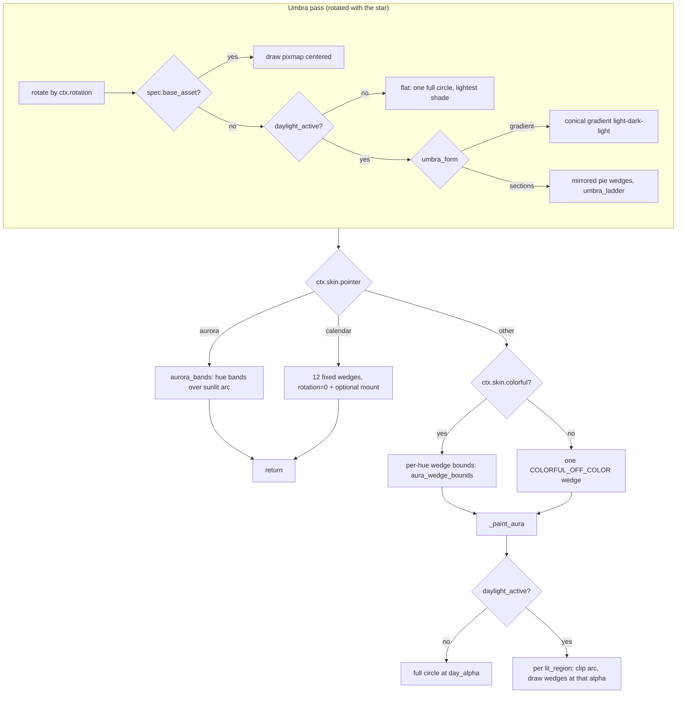

# Background Layer — Flow

**About:** [description](../__about/background.md)

## Algorithm

Pseudocode (language-neutral):

    rotate painter by ctx.rotation
    IF background has a base image asset:
        draw it centered, 2x umbra_radius
    ELSE IF daylight law is off:
        fill one full circle in the lightest contrast shade
    ELSE IF umbra_form is "gradient":
        conical gradient: lightest at top, darkest at bottom, lightest again
    ELSE:                                   # discrete sections
        FOR EACH mirrored pair of sections around the wheel:
            draw pie slice pair at the section's shade
    restore rotation

    IF pointer == "aurora":
        FOR EACH (start, end, hue, alpha) IN aurora_bands(sun, palette):
            draw pie slice at that hue/alpha (rotated if solar-framed)
        RETURN
    IF pointer == "calendar":
        paint 12 fixed 2-hour wedges at rotation 0
        IF calendar_mount != "off": draw the mount
        RETURN

    hues = colorful ? palette : (COLORFUL_OFF_COLOR,)
    wedges = aura_wedge_bounds(skin, hues)      # each hue's own lead-ray span
    _paint_aura(radius=aura_radius, hues, wedges, rotation=ctx.rotation)

    FUNCTION _paint_aura(radius, hues, wedges, rotation):
        IF daylight law is off:
            set opacity = day_alpha; rotate by `rotation`
            FOR EACH (hue, wedge) IN zip(hues, wedges): draw pie slice
        ELSE:
            FOR EACH (start, end, alpha) IN lit_regions(sun, spec):
                clip to that arc; set opacity = alpha; rotate by `rotation`
                FOR EACH (hue, wedge) IN zip(hues, wedges): draw pie slice
