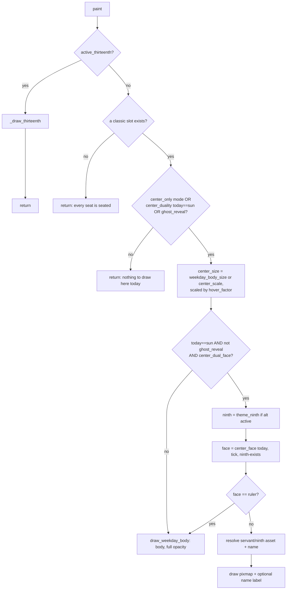

# Center Body Layer — Flow

**About:** [description](../__about/center_body.md)

## Algorithm

Pseudocode (language-neutral):

    # THE BLUE MOON LAW — checked first, independent of everything below
    thirteenth = active_thirteenth(skin, day)
    IF thirteenth is not None:
        _draw_thirteenth(thirteenth); RETURN

    IF no classic (unseated) slot exists: RETURN   # every seat is seated
    ghost_reveal = reveal_active AND mode != center_only AND center_duality
    IF mode != center_only
       AND NOT (center_duality AND today == "sun")
       AND NOT ghost_reveal:
        RETURN                                      # nothing to show here

    center_size = (2*radius*center_scale IF mode==center_only
                   ELSE weekday_body_size()) * hover_factor("body:today")
    body = "sun" IF ghost_reveal ELSE today

    IF today == "sun" AND NOT ghost_reveal AND center_dual_face(skin):
        ninth = theme_ninth(theme, ninth_alt_active) IF the theme names one
        face = center_face(day, tick, ninth is not None)   # solar-time pick
        IF face != "ruler":
            asset, name = servant's plate/name OR the ninth's (name, asset)
            draw asset centered at full opacity; draw name label IF names on
            RETURN

    draw_weekday_body(body, hub, center_size, opacity=1.0, label)

    FUNCTION _draw_thirteenth(key):
        name, asset = thirteenth_plate(key)
        center_size = (center_scale or weekday_body_size) * hover_factor("thirteenth")
        IF asset is not None: draw it centered, opaque
        IF asset is None OR names are on: draw the name label
