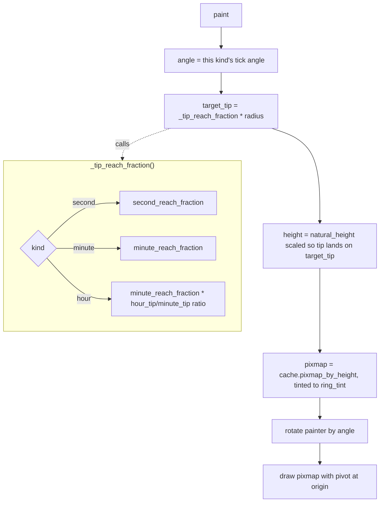

# Hand Layer — Flow

**About:** [description](../__about/hand.md)

## Algorithm

Pseudocode (language-neutral):

    spec = hand spec for this instance's kind (hour/minute/second)
    angle = tick's angle for this kind (hour_angle / minute_angle / second_angle)

    FUNCTION _tip_reach_fraction():
        IF kind == "second": RETURN second_reach_fraction
        IF kind == "minute": RETURN minute_reach_fraction
        # hour: derive from the pack's own hour/minute tip-height ratio
        hour_tip = hour.natural_height - hour.pivot_y
        minute_tip = minute.natural_height - minute.pivot_y
        RETURN minute_reach_fraction * hour_tip / minute_tip

    tip_units = spec.natural_height - spec.pivot_y
    target_tip = _tip_reach_fraction() * ctx.radius
    height = spec.natural_height * (target_tip / tip_units)   # uniform scale

    pixmap = cache.pixmap_by_height(spec.asset, height, dpr,
                                     tint=ring_tint, desaturate=hands.desaturate)
    pivot_x = logical_width * (spec.pivot_x_fraction OR 0.5)

    rotate painter by `angle`
    draw pixmap at (-pivot_x, -target_tip)     # pivot lands on the origin
