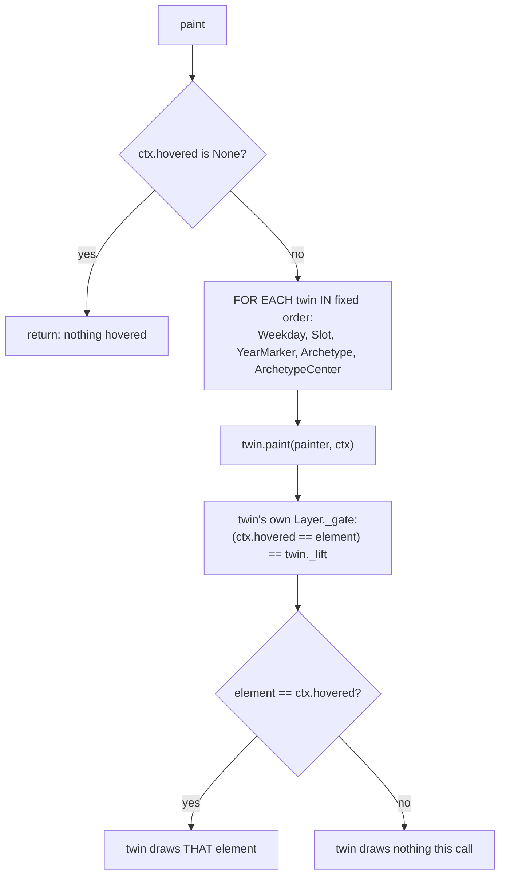

# Hover Lift Layer — Flow

**About:** [description](../__about/hover_lift.md)

## Algorithm

Pseudocode (language-neutral):

    IF ctx.hovered is None: RETURN     # nothing under the cursor this frame

    FOR EACH twin IN (WeekdayLayer, SlotLayer, YearMarkerLayer,
                       ArchetypeLayer, ArchetypeCenterLayer):   # lift=True
        twin.paint(painter, ctx)
        # each twin's internal element loop calls Layer._gate(ctx, element),
        # which for a lift=True instance is only True when
        # ctx.hovered == element — so at most one twin, drawing at most one
        # element, actually paints anything on a given frame

Gating symmetry (why nothing draws twice): a base-pass layer's `_gate`
returns `True` for every element EXCEPT the hovered one (`lift=False`); the
matching twin here returns `True` ONLY for the hovered one (`lift=True`).
The two passes partition the element set exactly — the twin's draw call is
simply appended LAST in z-order, so the hovered element's redraw lands above
the hands and every other layer.
