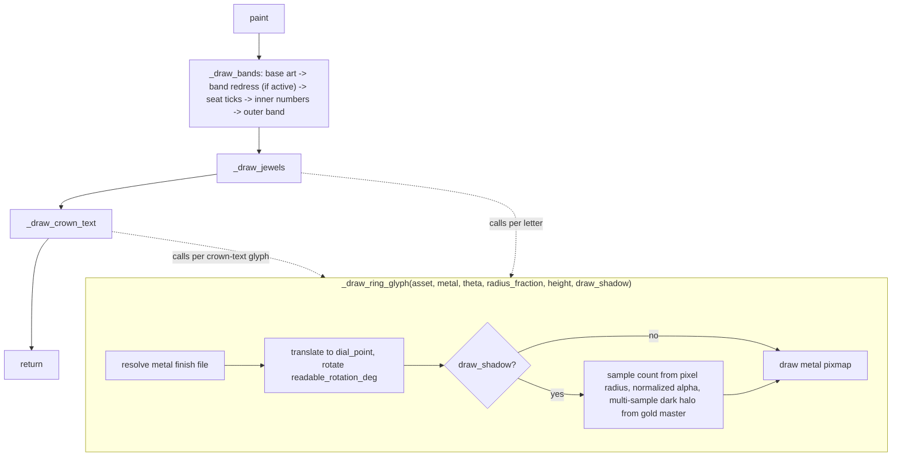

# Ring Layer — Flow

**About:** [description](../__about/ring.md)

## Algorithm

Pseudocode (language-neutral): THE COMPOSITIONAL RING MODEL (owner
decree 2026-08-05) — always both bands, never a single plate:

    _draw_bands():
        draw inner_asset tinted (ring_tint_inner, follows ring_tint if None) + saturated, full size
        draw outer_asset tinted (ring_tint) + saturated, full size, ON TOP
    _draw_jewels()      # per-hour letters, untinted (unless jewels_tint set)
    _draw_crown_text()      # top/bottom Crown Text arcs, untinted (unless crown_text_tint set)

    FUNCTION _draw_ring_glyph(gold_asset, metal, theta, radius_fraction, height, draw_shadow=True):
        asset = jewel_metal_file(gold_asset, metal)     # derived, disk-cached
        rotation = readable_rotation_deg(theta)   # THE ONE SEATING LAW (2026-08-07):
                                                  #   theta MOD 90 == 0  -> 0, stands UPRIGHT
                                                  #   lower half         -> flipped 180
                                                  # an alias of core.numerals.seat_rotation,
                                                  # so jewels seat exactly like the numerals
        translate to dial_point(theta, radius * radius_fraction); rotate
        IF draw_shadow:
            samples = shadow_sample_count(shadow_radius * ctx.dpr)   # >= floor RING_JEWEL_SHADOW_SAMPLES
            alpha = normalized_shadow_alpha(samples)                  # composited darkness == floor look
            FOR EACH of `samples` halo copies around a small radius:
                draw the gold-tinted shadow silhouette at `alpha`
        draw the metal-finish pixmap centered, full opacity

    FUNCTION _draw_jewels():
        FOR EACH (hour, gold_asset) IN skin's jewel_art:
            _draw_ring_glyph(..., height * jewel_zoom[hour], draw_shadow=NOT jewel_no_shadow[hour])

    FUNCTION _draw_crown_text():
        # THE DECOUPLED SCALES (2026-08-07): crown_text_scale ALONE.
        # ring_jewels_scale used to multiply this too, so the Jewels
        # slider grew the crown; both default 1.0, so the fold is 1.0.
        height = 2 * radius * RING_CROWN_TEXT_SIZE * crown_text_scale
        IF skin has no crown texts: RETURN
        FOR EACH crown_entry IN skin's crown_text:
            FOR EACH (gold_asset, theta) IN crown_entry's glyphs:
                _draw_ring_glyph(..., dial.RING_CROWN_TEXT_RADIUS_FRACTION, height)
