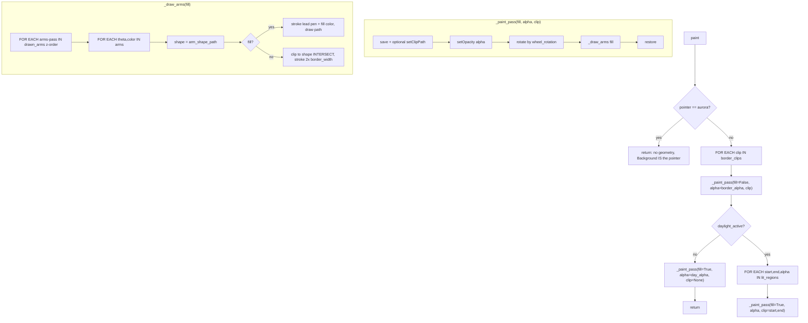

# Star Layer — Flow

**About:** [description](../__about/star.md)

## Algorithm

Pseudocode (language-neutral):

    IF pointer == "aurora": RETURN   # armless — the Background layer IS it

    FOR EACH clip IN border_clips(skin, sun):      # usually the whole circle
        _paint_pass(fill=False, alpha=border_alpha, clip)

    IF daylight law is off:
        _paint_pass(fill=True, alpha=day_alpha, clip=None)   # flat full color
        RETURN
    FOR EACH (start, end, alpha) IN lit_regions(sun, spec):
        _paint_pass(fill=True, alpha, clip=(start, end))

    FUNCTION _paint_pass(fill, alpha, clip):
        IF clip is not None: set clip path to that dial arc
        set opacity = alpha
        rotate by wheel_rotation(skin, ctx.rotation)
        _draw_arms(fill)

    FUNCTION _draw_arms(fill):
        FOR EACH arm-pass IN drawn_arms(skin, palette):    # z-order within the star
            FOR EACH (theta, color) IN arm-pass:
                shape = arm_shape_path(skin, tip, theta)
                IF fill:
                    stroke the shared lead pen, fill `color`, draw `shape`
                ELSE:
                    clip (intersect) to `shape`; stroke at 2x border width,
                    no brush — only the inner half of the stroke shows
