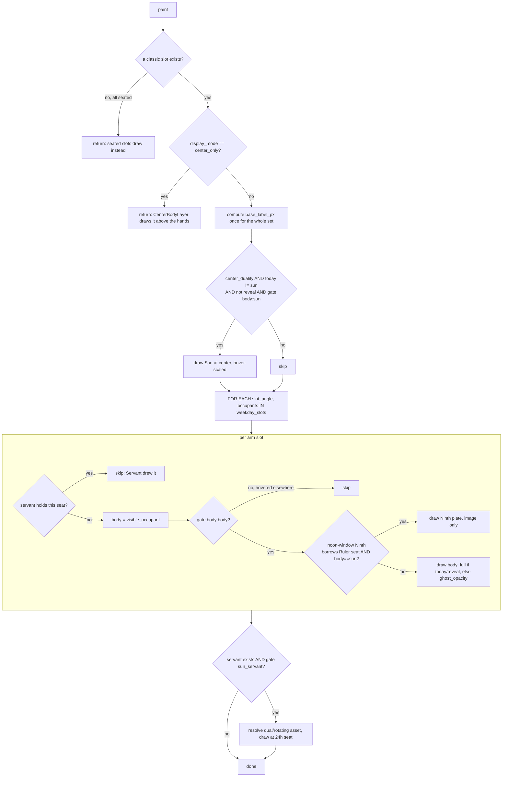

# Weekday Layer — Flow

**About:** [description](../__about/weekday.md)

## Algorithm

Pseudocode (language-neutral):

    IF no classic (unseated) slot exists: RETURN   # every seat is seated
    IF display_mode == "center_only": RETURN        # CenterBodyLayer owns it

    base_label_px = weekday_label_set_px() IF names are on ELSE None

    IF center_duality AND today != "sun" AND NOT reveal_active
       AND gate("body:sun"):
        draw the Sun at the hub, size *= hover_factor("body:sun")

    FOR EACH (slot_angle, occupants) IN weekday_slots(skin):
        IF the Servant holds this exact seat today: CONTINUE   # drawn below
        body = visible_occupant(occupants, today)              # priority pick
        IF NOT gate(f"body:{body}"): CONTINUE                   # hovered away
        theta = slot_angle + ctx.rotation
        IF a Ninth plate has borrowed the Ruler's seat AND body == "sun":
            draw the Ninth's plate (image only) at this seat; CONTINUE
        opacity = 1.0 IF body == today OR reveal_active ELSE ghost_opacity
        draw_weekday_body(body, position, size * hover_factor, opacity, label)

    IF the theme has a Servant AND gate("sun_servant"):
        resolve the Servant's asset (theme dual art, live sky variant for
        continents, the day's rotating _v2/alt sibling if any)
        IF a Ninth plate has borrowed the Servant's seat: swap the asset
        opacity = 1.0 IF today == "sun" OR reveal_active ELSE ghost_opacity
        draw the Servant at its fixed 24h seat
