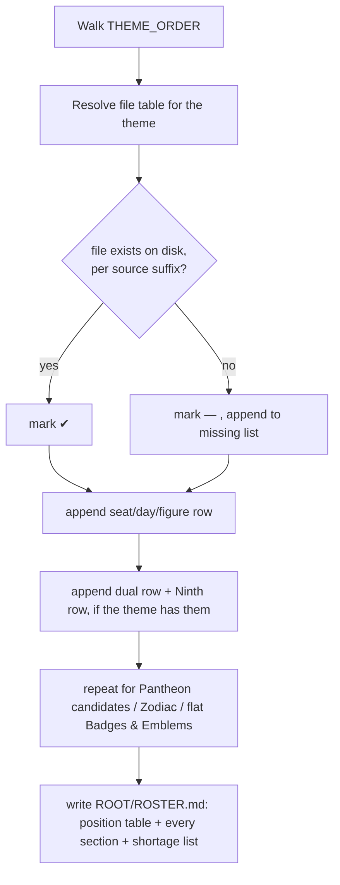

# Build Roster — Flow

**About:** [description](../__about/build_roster.md)

## Algorithm

Pseudocode (language-neutral):

    FOR EACH theme IN THEME_ORDER:
        resolve the theme's figure-file table
        FOR EACH of the 7 weekday seats:
            FOR EACH source IN (gemini, chatgpt):
                IF the source-suffixed (or bare) file exists on disk → mark tick
                ELSE → mark dash, record "source: path" in the shortage list
        IF the theme has a Sunday dual → mark it the same way
        IF the theme has a Ninth → mark it the same way
    REPEAT the same per-source existence check for:
        the 4 Pantheon themes' candidate rosters
        the Zodiac families (astrology signs, Chinese animals)
        the flat Badge and Emblem groups
    WRITE ROSTER.md:
        the seat-archetype table (color/virtue/vice/mood/estate)
        every section built above
        the shortage list, grouped by source
