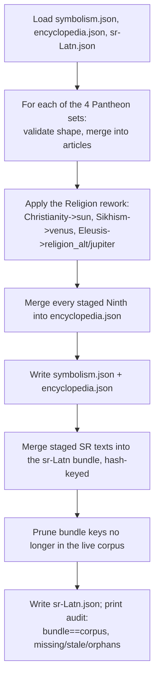

# Merge Articles — Flow

**About:** [description](../__about/merge_articles.md)

## Algorithm

Pseudocode (language-neutral):

    LOAD symbolism.json, encyclopedia.json, sr-Latn.json

    FOR EACH of the 4 Pantheon staging files (greek/egypt/norse/slavic):
        ASSERT every body's entry is well-shaped ($ref, OR base + the 6
        variant keys, each non-empty)
        MERGE its 7 bodies into symbolism["articles"][theme]
        MERGE its Ninth entries into encyclopedia["ninths"]
        COLLECT its staged Serbian texts

    APPLY the Religion rework (three named seat moves), same shape checks
    WRITE symbolism.json, encyclopedia.json

    corpus = collect_corpus()   # every article text key the app needs today
    MERGE staged Serbian texts into the bundle, keyed by a hash of the
    matching English source (so a later English edit is detectable as stale)
    PRUNE bundle keys no longer present in corpus

    WRITE sr-Latn.json
    PRINT bundle-size == corpus-size, missing keys, stale keys, orphans pruned
