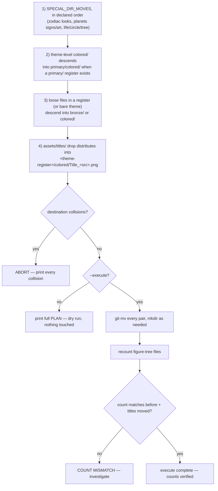

# Migrate Tree Law — Flow

**About:** [description](../__about/migrate_tree_law.md)

## Algorithm

Pseudocode (language-neutral):

    PLAN = []
    1) FOR EACH (special_src, special_dst) IN the declared SPECIAL_DIR_MOVES:
           move every file inside special_src -> special_dst
    2) FOR EACH theme-level "colored/" folder under weeks|calendars|archetypes:
           IF its parent also has a "primary/" register:
               descend colored/ into primary/colored/
    3) FOR EACH folder holding loose files directly (a bare theme or a register):
           look = "bronze" IF a colored twin set already exists ELSE "colored"
           move every loose file into <base>/<look>/
    4) FOR EACH file under assets/titles/:
           resolve its destination theme via the TITLES_MAP
           move it into <theme-register>/colored/Title_<src>.png
           (an unresolved or still-pending key is logged as a note, left in place)

    CHECK every planned destination for a collision (already exists, or two
    sources landing on the same target) -> ABORT before touching anything
    IF --execute:
        perform every git mv (creating directories as needed)
        recount figure-tree files; verify before == after + titles moved
    ELSE:
        print the PLAN only
