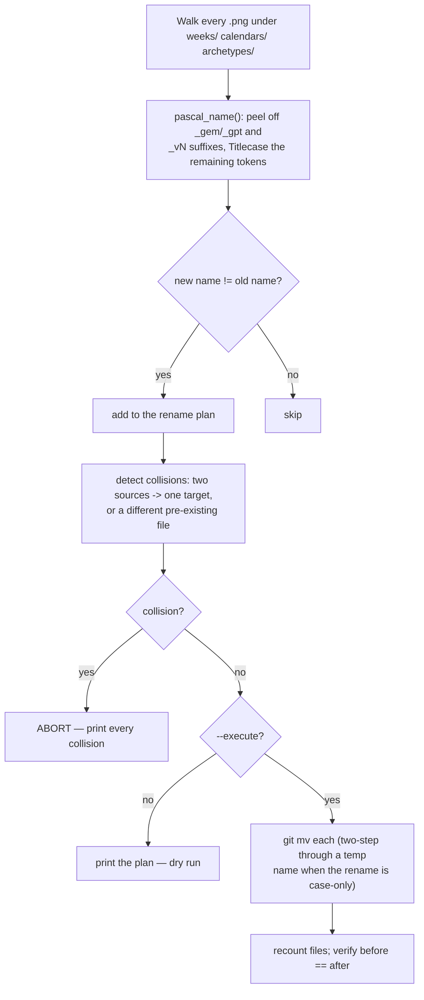

# PascalCase Stems — Flow

**About:** [description](../__about/pascalcase_stems.md)

## Algorithm

Pseudocode (language-neutral):

    FOR EACH png UNDER weeks/, calendars/, archetypes/:
        tokens = stem split on "_"
        peel a trailing source tag (_gem/_gpt) off the tokens, keep it verbatim
        peel a trailing _vN version tag off the tokens, keep it verbatim
        Titlecase every remaining token that has no uppercase letter already
        new_name = the Titlecased tokens + the peeled tail, rejoined
        IF new_name != old_name: PLAN a rename

    DETECT collisions: two different sources renaming onto the same target,
    or a target that already exists as a genuinely DIFFERENT file
    IF any collision: ABORT, print them all

    IF --execute:
        FOR EACH planned rename:
            IF old and new differ only by case: git mv through a temp name
            ELSE: git mv directly
        recount files; verify the total is unchanged
    ELSE:
        print the plan only
