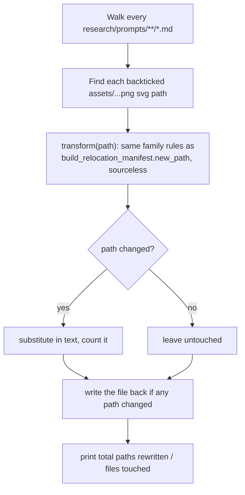

# Rewrite Sheet Paths — Flow

**About:** [description](../__about/rewrite_sheet_paths.md)

## Algorithm

Pseudocode (language-neutral):

    FOR EACH sheet UNDER research/prompts/ (recursively):
        text = read the sheet
        FOR EACH backticked "assets/....png" or "....svg" path found in text:
            new_path = transform(path)   # same per-root rules as the
                                          # relocation manifest, minus the
                                          # source-folder collapse and suffix
            IF new_path != path: substitute it, count the change
        IF the sheet's text changed: write it back
    PRINT total paths rewritten, total files touched
