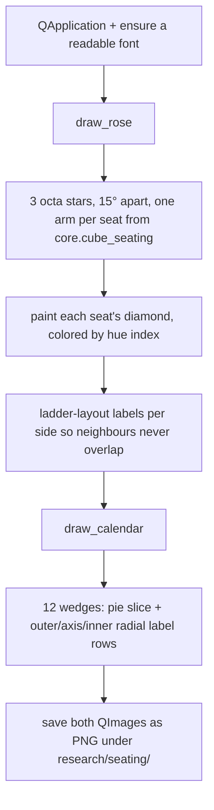

# Seating Preview — Flow

**About:** [description](../__about/seating_preview.md)

## Algorithm

Pseudocode (language-neutral):

    ENSURE a usable font (native Qt plugin; else load a bundled system TTF)

    DRAW ROSE:
        FOR EACH of the 3 stars (offset -15 / 0 / +15 degrees):
            FOR EACH seat ON that star:
                paint its diamond arm, colored by the seat's hue index
        LAY OUT ray labels in per-side ladders (sorted by height, pushed
        apart to a minimum gap) so neighbouring rays never overwrite text

    DRAW CALENDAR:
        FOR EACH of the 12 monthly wedges:
            paint the pie slice
            paint three radial label rows: outer end, axis name, inner end

    SAVE both QImages as PNG under research/seating/
