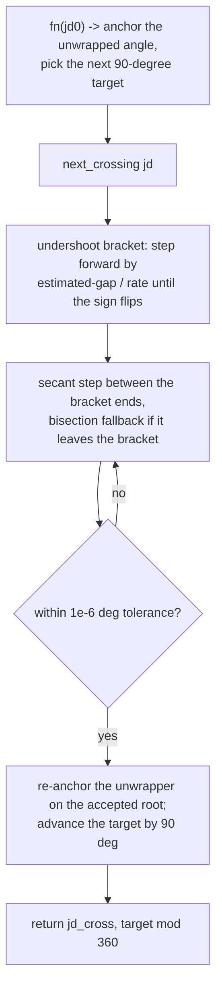

# Ephemeris Common — Flow

**About:** [description](../__about/ephemeris_common.md)

## Algorithm — Marcher.next_crossing

Pseudocode (language-neutral):

    STATE: ref_u = unwrap(fn(jd0)); next_target = the next 90-degree
           multiple strictly above ref_u

    FUNCTION next_crossing(jd):
        target = next_target
        a = jd; fa = unwrap(fn(a)) - target        # <= 0 by construction
        ESTIMATE a forward step from the known angular rate; extend (a, b)
        forward, UNTIL unwrap(fn(b)) - target >= 0  (undershoot bracket)
        LOOP secant between (a, fa) and (b, fb), falling back to bisection
        whenever the secant point would land outside [a, b]:
            UNTIL the residual is within 1e-6 degrees
        RE-ANCHOR the unwrapper at the accepted root (so the next call's
        unwrapping stays continuous)
        next_target += 90
        RETURN (accepted_jd, target mod 360)
