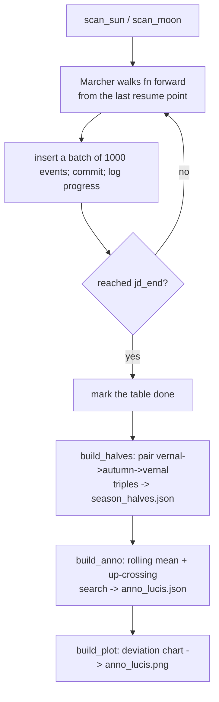

# Extract — Flow

**About:** [description](../__about/extract.md)

## Algorithm

Pseudocode (language-neutral):

    FUNCTION scan(table, fn, rate):
        RESUME from meta[table_last_jd] IF present, ELSE start at YEAR_START
        marcher = Marcher(fn, jd, rate)
        LOOP:
            jc, target = marcher.next_crossing(jd)
            IF jc > jd_end: STOP
            RECORD (jd_tt, jd_ut, iso_ut, target); jd = jc
            EVERY 1000 events: commit the batch, save the resume point,
                log progress (elapsed, count/total, rate)
        MARK the table done

    BUILD_HALVES:
        walk sun_events' equinoxes in time order
        FOR EACH (vernal, autumn, next-vernal) triple:
            light = autumn - vernal;  dark = next-vernal - autumn
            RECORD {year: [light_days, dark_days]}

    BUILD_ANNO:
        diff = rolling_mean(light - dark, window = 71 years)
        FIND the smoothed negative-to-positive crossing nearest 4000 BCE
        SEPARATELY find the first year starting a 100-consecutive-year
        run of light > dark (the raw, unsmoothed criterion)
        RECORD both candidates + the method note

    BUILD_PLOT:
        draw light/dark deviation-from-mean curves across the whole span,
        mark the Anno Lucis year, save PNG
