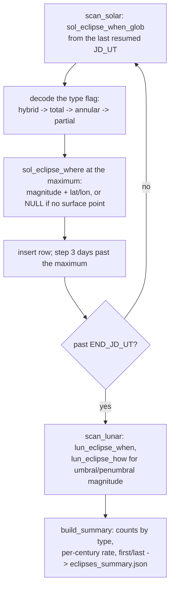

# Extract Eclipses — Flow

**About:** [description](../__about/extract_eclipses.md)

## Algorithm

Pseudocode (language-neutral):

    FUNCTION scan_solar / scan_lunar (mirror shape):
        RESUME from meta[table_last_jd] IF present, ELSE START_JD_UT
        LOOP:
            (flag, tmax) = the Swiss Ephemeris' global eclipse finder,
                           starting from the current JD_UT
            IF tmax > END_JD_UT: STOP
            type = decode(flag)     # hybrid tested before total/annular/partial
            (magnitude, lat, lon) = the "where"/"how" finder at tmax
                                     (place is NULL if no surface point, solar only)
            jd_tt = tmax + deltat(tmax)
            RECORD (jd_tt, tmax, iso_ut(tmax), type, magnitude, lat, lon)
            jd = tmax + 3 days                      # clears the found event
            EVERY 500 events: commit the batch, save the resume point, log progress
        MARK the table done

    BUILD_SUMMARY:
        FOR EACH of solar_eclipses / lunar_eclipses:
            COUNT rows per type; compute per-century rate over the scan span
            RECORD first and last event
        WRITE eclipses_summary.json with both tables' stats + the ΔT caveat text
