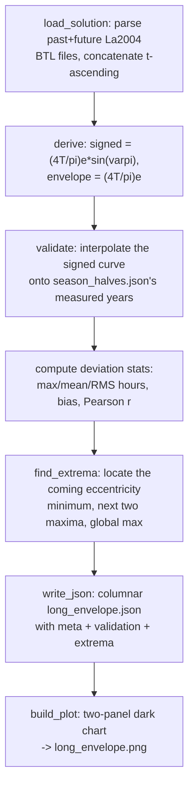

# Long Envelope — Flow

**About:** [description](../__about/long_envelope.md)

## Algorithm

Pseudocode (language-neutral):

    LOAD the past (0..-51000 kyr) and future (0..+21000 kyr) La2004 files
    CONCATENATE into one t-ascending solution: (t_kyr, e, obliquity, varpi)

    DERIVE:
        signed   = (4T/pi) * e * sin(varpi)      # T = 365.2422 days
        envelope = (4T/pi) * e

    VALIDATE (against season_halves.json, the DE441-measured series):
        FOR EACH measured year: interpolate signed(t) at that year
        RESIDUAL = interpolated - measured
        REPORT max/mean/RMS |residual| in hours, mean signed bias, Pearson r,
        spot values at a few notable years, e(today)

    FIND_EXTREMA:
        LOCATE the envelope minimum in the +5..+45 kyr window (coming
        eccentricity minimum)
        LOCATE the first local maximum in +45..+110 kyr (recovery peak)
        LOCATE the maximum in +110..+200 kyr (the next major maximum)
        LOCATE the global maximum over the WHOLE fetched span

    WRITE_JSON: full columnar series (t_kyr, e, signed, envelope) plus a
    meta block (formula, source, validation results, extrema)

    BUILD_PLOT:
        panel 1 = the +/-200 kyr envelope with the signed oscillation, the
        present, the DE441 overlap shaded, and the extrema annotated
        panel 2 = the whole solution span as peak amplitude per 100-kyr
        window, showing the eccentricity beat and the grand maximum
