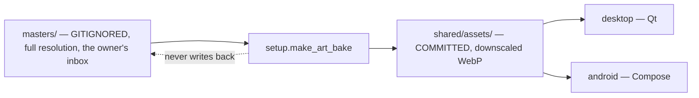
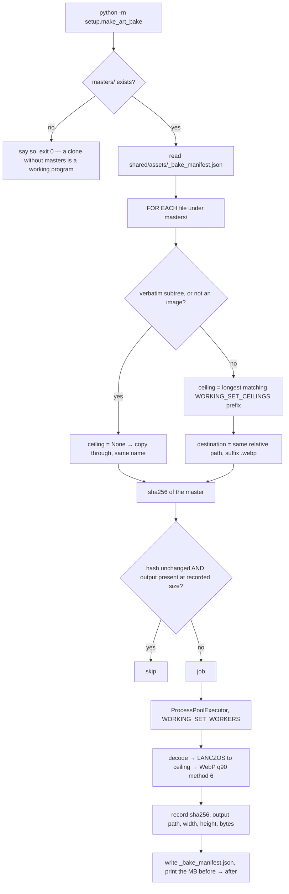
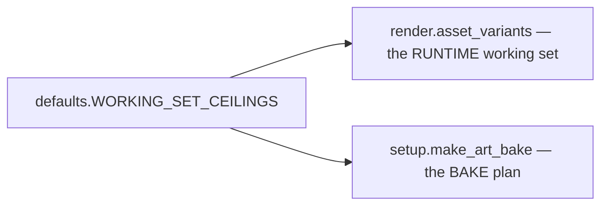

# Make Art Bake — Flow

**About:** [description](../__about/make_art_bake.md)

## The one-way arrow

## The bake

Pseudocode:

    FUNCTION bake(force):
        masters = paths.masters_dir()          # None in a frozen build
        IF masters IS None: RETURN 0           # not an error
        previous = manifest["files"] UNLESS force
        jobs, skipped = plan(masters, assets, previous, force)
        POOL over jobs:
            bake_one(source, destination, ceiling, ART_BAKE_QUALITY)
        write manifest(quality, ceilings, files)

## Why the ceilings are not here

One table, two readers. The runtime asks "is this file bigger than the
dial can ever draw it?"; the bakery asks "how big may this file be when
we ship it?" — the same question at two times. A second list would let
the shipped tree and the program's own idea of big-enough drift apart
without either side being wrong, and nothing would notice.

`tests/test_art_bake.py::test_the_bakery_has_no_ceilings_of_its_own`
fails if a future round ever restates one.

## Why a skip is safe

The manifest key is the **source master's sha256**, not a timestamp and
not the output's own hash. Three consequences:

- Touching a master without changing its bytes rebakes nothing.
- Replacing a master with different pixels under the same filename —
  the exact case a mtime check gets wrong when a tool preserves
  timestamps — rebakes it.
- Deleting the output rebakes it, because the manifest also requires
  the destination to exist at the recorded byte size.

And the failure mode of a WRONG skip is bounded: the shipped file is
then simply the previous bake of that name. `test_art_bake.py::
test_no_shipped_art_exceeds_its_ceiling` still walks the real tree, so
an oversized file cannot survive a session either way.
