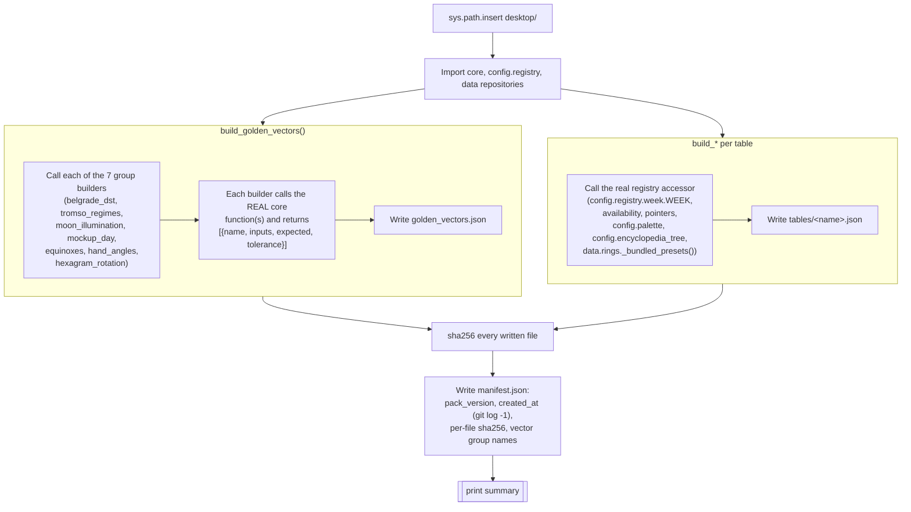

# Contract Pack Generator — Flow

**About:** [description](../__about/make_contract_pack.md)

## Algorithm — two independent export passes, one manifest

Pseudocode (language-neutral):

    insert desktop/ onto sys.path
    import core.*, config.registry.*, data.* (the real desktop packages)

    # --- golden vectors ---------------------------------------------------
    groups = {}
    FOR EACH (group_name, builder) IN VECTOR_GROUPS:
        groups[group_name] = builder()     # calls real core functions,
                                            # returns named input/expected/
                                            # tolerance vectors
    write golden_vectors.json { meta, groups }

    # --- table exports ------------------------------------------------------
    FOR EACH (table_name, builder) IN TABLE_BUILDERS:
        payload = builder()                # reads the real registry module
        write tables/<table_name>.json (payload)

    # --- manifest ------------------------------------------------------------
    hashes = { path: sha256(path) FOR EACH written file }
    manifest = {
        pack_version: "1",
        created_at: `git log -1 --format=%cI`,   # never wall clock
        vector_groups: sorted(groups.keys()),
        files: hashes,
    }
    write manifest.json

    print "N vector groups (M vectors), K tables -> shared/contract/"
