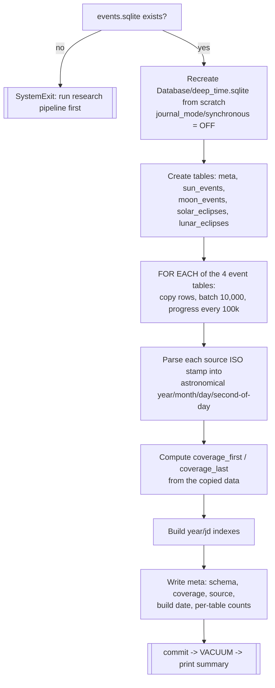

# Deep Time Pack Generator — Flow

**About:** [description](../__about/make_deep_time.md)

## Algorithm — table copy + coverage-bound computation

Pseudocode (language-neutral — the coverage-bound trap):

    IF events.sqlite missing: exit with instructions

    recreate deep_time.sqlite (drop if present)
    create empty tables: meta, sun_events, moon_events,
                          solar_eclipses, lunar_eclipses

    FOR EACH source table (sun_events, moon_events,
                           solar_eclipses, lunar_eclipses):
        FOR EACH row, ordered by time:
            parse ISO stamp -> (year, month, day, second_of_day)
            batch-insert every 10,000 rows
            log progress every 100,000 rows

    # coverage = the years the APP may safely render.
    # A rendered year Y needs its NEIGHBORS fully present:
    #   - the December solstice of Y-1 and the March equinox of Y+1
    #     (season anchors)
    #   - the January-February moon events of Y-1 and Y+1
    #     (the Chinese New Year cusp)
    # TRAP (found 2026-07-17): the scan starts mid-year, so the very
    # first scanned year has no January - a naive "extents trimmed by
    # one year" bound lets that edge year crash the day build. A March
    # sun event in a year proves that year's January-February moon
    # events are fully scanned, so the bound is read FROM THE DATA:
    coverage_first = MAX(
        MIN(year WHERE sun_events.type == December solstice) + 1,
        MIN(year WHERE moon_events.month == January) + 1,
    )
    coverage_last = MIN(
        MAX(year WHERE sun_events.type == December solstice),
        MAX(year WHERE sun_events.type == March equinox) - 1,
        MAX(year WHERE moon_events.month == March) - 1,
    )

    build indexes (year on sun/moon, jd_ut on the eclipse tables)
    write meta rows (schema=1, coverage_first, coverage_last, source,
                      built=today, count_<table> per table)
    commit -> VACUUM -> print "done" with size and per-table counts
