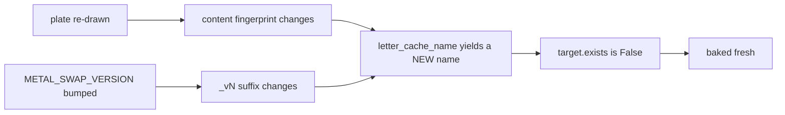

# Make Letter Bake — Flow

**About:** [description](../__about/make_letter_bake.md)

## The bake

```mermaid
flowchart TB
    A[python -m setup.make_letter_bake] --> B[QGuiApplication — QImage needs one]
    B --> C[plates = every png under assets/instrument/letters/]
    C --> D[finishes = every metal,shade pair in METAL_SHADES]
    D --> E[FOR EACH plate x finish]
    E --> F[name = letter_cache_name plate, metal, shade]
    F --> G{assets/_baked/letters/name exists?}
    G -- yes, and no --force --> H[skip]
    G -- no --> I[bake_letter_finish: AssetCache._recolored from the GOLD master, alpha mask]
    I --> J[atomic_save into the bake folder]
    J --> E
    H --> E
    E -- done --> K[letter_bake.refresh, print count and megabytes]
```

Pseudocode:

    FUNCTION bake(force):
        destination = letter_bake.bake_dir()          # assets/_baked/letters/
        FOR EACH master IN sorted(letters_root.rglob("*.png")):     # 57
            FOR EACH (metal, shade) IN METAL_SHADES pairs:          # 34
                name   = letter_cache_name(master, metal, shade)
                target = destination / name
                IF target.exists() AND NOT force:
                    skipped += 1;  CONTINUE
                TRY:
                    bake_letter_finish(master, metal, shade, target)
                    built += 1
                EXCEPT OSError, ValueError AS error:
                    print("  ! ", master.stem, metal, shade, error)  # never fatal
        letter_bake.refresh()

`letter_cache_name` is imported from `render.asset_recolor` — the SAME
call `jewel_metal_path` makes at runtime. That is the entire
correctness argument for the bake: this script cannot write a name the
program will not look for, because it does not know how to spell one
itself.

## Why the skip is safe



The corollary is what makes the whole design safe rather than merely
fast: the OLD files are still on disk, and the running program no
longer asks for any of them. It derives those finishes live, exactly as
it did before a bake existed. A stale bake cannot paint a stale letter;
it can only fail to save time.
