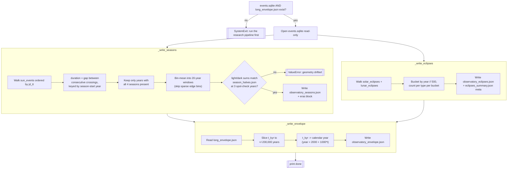

# Observatory Series Generator — Flow

**About:** [description](../__about/make_observatory.md)

## Algorithm — three independent decimation passes

Pseudocode (language-neutral):

    IF events.sqlite missing OR long_envelope.json missing:
        exit with instructions

    open events.sqlite read-only

    # --- seasons -----------------------------------------------------
    by_year = {}
    prev = None
    FOR EACH (jd_tt, iso_ut, crossing_type) IN sun_events ORDER BY jd_tt:
        IF prev is not None:
            season = SEASON_OF[prev.crossing_type]   # crossing -> season name
            by_year[year(prev.iso_ut)][season] = jd_tt - prev.jd_tt
        prev = (jd_tt, iso_ut, crossing_type)
    durations = { y: seasons FOR y, seasons IN by_year
                  IF all 4 seasons present }

    binned = bin-mean(durations, bin_size=20 years,
                       skip bins with < 10 of their 20 years measured)

    FOR spot_check_year IN (2026, 0, 1000):
        light = durations[year].spring + durations[year].summer
        dark  = durations[year].autumn + durations[year].winter
        IF |light - reference_light| > 1e-3 OR
           |dark  - reference_dark|  > 1e-3:
            RAISE ValueError (geometry drifted from season_halves.json)

    write observatory_seasons.json (binned series + eras block)

    # --- eclipses ------------------------------------------------------
    buckets = {}
    FOR EACH eclipse IN solar_eclipses + lunar_eclipses:
        key = year(eclipse.iso_ut) // 500
        buckets[key][eclipse.kind] += 1
    write observatory_eclipses.json (bucketed counts + summary meta)

    # --- envelope --------------------------------------------------------
    FOR EACH (t_kyr, signed, envelope) IN long_envelope.json:
        IF -200 <= t_kyr <= 200:
            year = 2000 + 1000 * t_kyr
            keep (year, signed, envelope)
    write observatory_envelope.json (sliced series)

    print "done"
