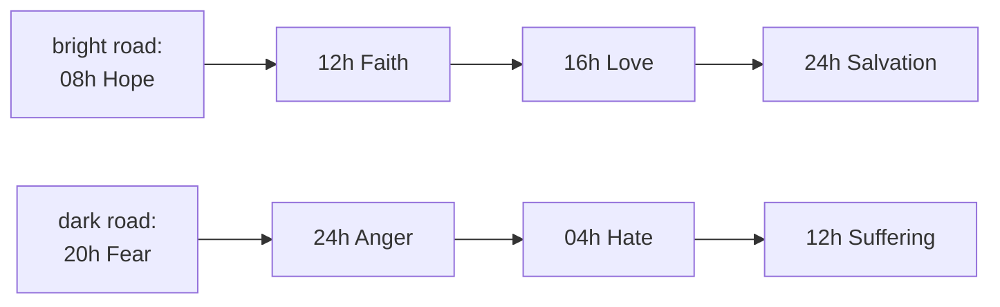

# Canon Diagrams — Flow

**About:** [description](../__about/canon_diagrams.md)

## The chiasm (`crosses`, `_draw_journey`)

Each road ends in the OTHER's hour — the bright road at midnight, the
dark road at noon. The dark road draws pulled slightly inward so the
two never overdraw where they share an arm (they share exactly two).

## The shared table drawer

    FUNCTION _draw_table(rows, headers):
        lay out a grid sized to `size`
        FOR EACH header: draw column title
        FOR EACH row: draw each cell, ELIDING text that overflows its column
                      (never wrapping, never shrinking the grid)

`sixty_five_terms`, `three_sets` and `union_fields` each build their
own `(rows, headers)` from doctrine/cube/archetypes data and hand them
to this one function — the only difference between the three pages is
which table they assemble.
