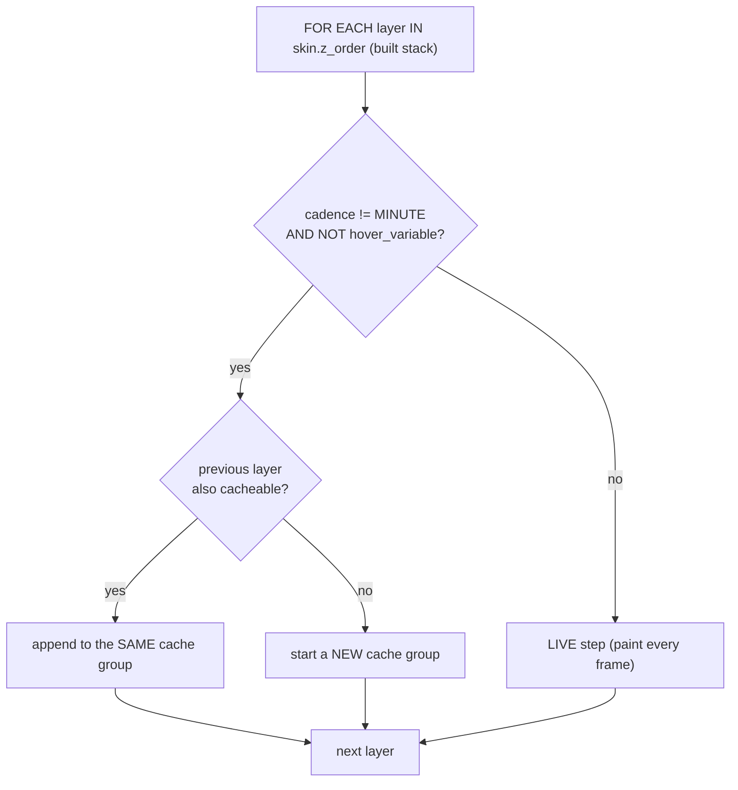
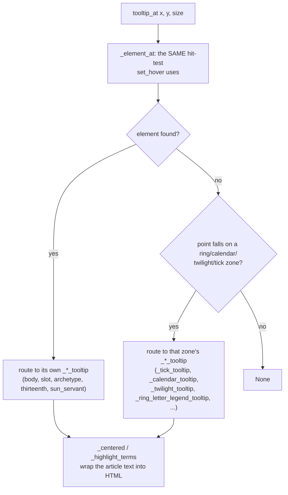

# Compositor — Flow

**About:** [description](../__about/compositor.md)

## The paint-step partition (`_plan_steps`, built once at construction)

Because the default `z_order` seats the weekday set BELOW the ring (a
STATIC layer), pulling the hover-variable weekday layer out SPLITS the
cache into two segments — background/star below, ring above — while
the drawn Z-order stays pixel-identical.

## The per-frame paint (`paint`)

    FUNCTION paint(painter, size, dpr, tick):
        key = (round(size*dpr), day.cache_key)     # NOT hover, NOT reveal
        IF key changed: drop all composites
        ctx = RenderContext(..., hovered=self._hovered, reveal_active=...)
        FOR EACH step IN self._steps:
            IF step is ("cache", group_index):
                IF composites[group_index] is None:
                    composites[group_index] = _render_group(cached_groups[group_index])
                blit composites[group_index] at (-overhang, -overhang)
            ELSE ("live", layer):
                IF reveal_active AND layer is a HandLayer: skip (hands hide)
                painter.save(); translate to center; layer.paint(painter, ctx); painter.restore()

## The tooltip dispatch (`tooltip_at` -> `_tooltip_at`)

Every `_*_tooltip` method reads the SAME skin-geometry/slot-layout/
ninths functions the paint pass uses (never a parallel hand-measured
geometry), then formats article prose from `SymbolismRepository`/
`EncyclopediaRepository` through the shared `_centered`/
`_highlight_terms` HTML helpers — the "term bank" that gives this file
its third responsibility.
