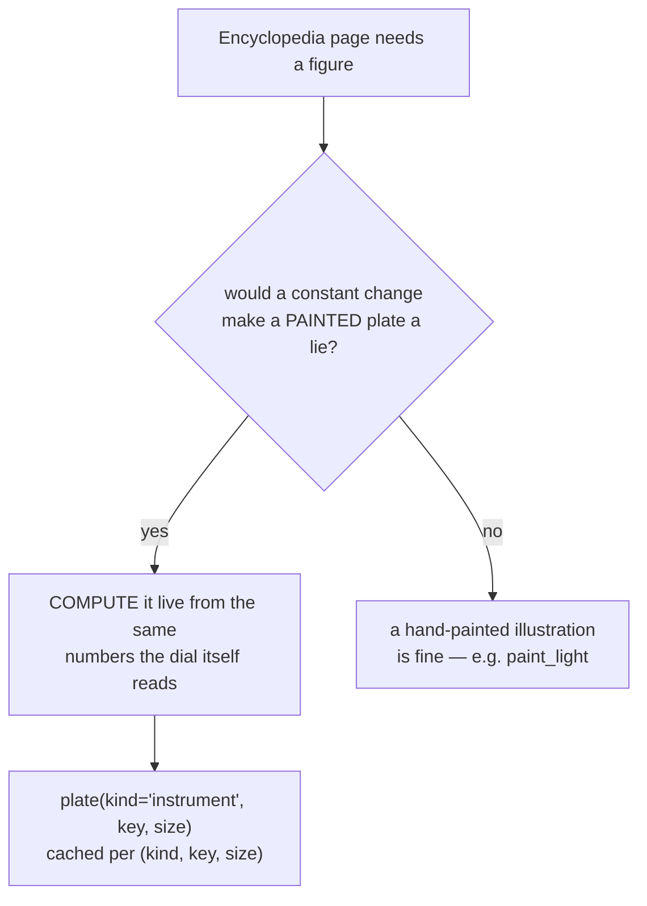

# Instrument Diagrams — Flow

**About:** [description](../__about/instrument_diagrams.md)

## The derivation check (root Rule #19), applied to a page

## One dispatcher, nine drawers

    FUNCTION plate("instrument", key, size):
        drawer = { "dial": _dial, "solar_rotation": _solar_rotation,
                   "twilight": _twilight, "year_wheel": _year_wheel,
                   "moon_lunations": _moon_lunations, "metals": _metals,
                   "ring_letters": _ring_letters,
                   "oscillations": _oscillations, "chi": _chi }[key]
        RETURN drawer(key, size)          # each reads its own live config/core numbers

Every drawer shares the same canvas/font/pen helpers (`_canvas`, `_font`,
`_pen`, `_on_dial`, `_text`, `_caption`) so the nine pages read as one
family despite covering unrelated subsystems (angles, twilight,
seasons, moon, metals, ring letters, orbital mechanics) — `_chi` is the
one exception: it skips the sketch helpers entirely and composes the
real ring plate.

## `_chi`'s own path — composed, not sketched

    FUNCTION _chi(key, size):
        outer = BandSpec(band="outer", pixels=size, letter_hours=(24,), ...)
        blit band_plate(outer)                      # render.numeral_bands — the
                                                      # SAME cache the dial reads
        WITH paths.display(metal_shades={"thematic": RING_THEMATIC_SHADES["CHI"]}):
            glyph = shared_cache().pixmap_by_height(X.png, height, metal="thematic")
        stamp glyph at ring_position_angle(24), rotated readable_rotation_deg(24)
        RETURN pixmap

`shared_cache()` is called directly (never `letter_metal_file`'s
deferred door) — a plate built once and cached forever must never
freeze on the GOLD fallback a cold background warm-up would otherwise
leave it on.
