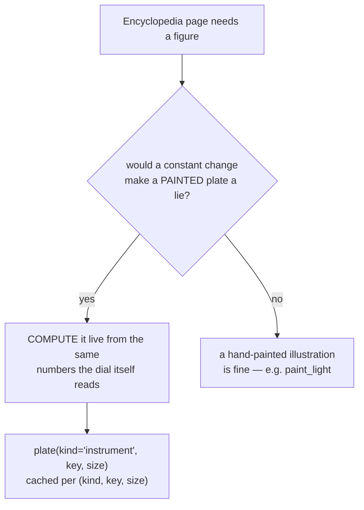

# Instrument Diagrams — Flow

**About:** [description](../__about/instrument_diagrams.md)

## The derivation check (root Rule #19), applied to a page

## One dispatcher, eight drawers

    FUNCTION plate("instrument", key, size):
        drawer = { "dial": _dial, "solar_rotation": _solar_rotation,
                   "twilight": _twilight, "year_wheel": _year_wheel,
                   "moon_lunations": _moon_lunations, "metals": _metals,
                   "ring_letters": _ring_letters,
                   "oscillations": _oscillations }[key]
        RETURN drawer(key, size)          # each reads its own live config/core numbers

Every drawer shares the same canvas/font/pen helpers (`_canvas`, `_font`,
`_pen`, `_on_dial`, `_text`, `_caption`) so the eight pages read as one
family despite covering unrelated subsystems (angles, twilight,
seasons, moon, metals, ring letters, orbital mechanics).
