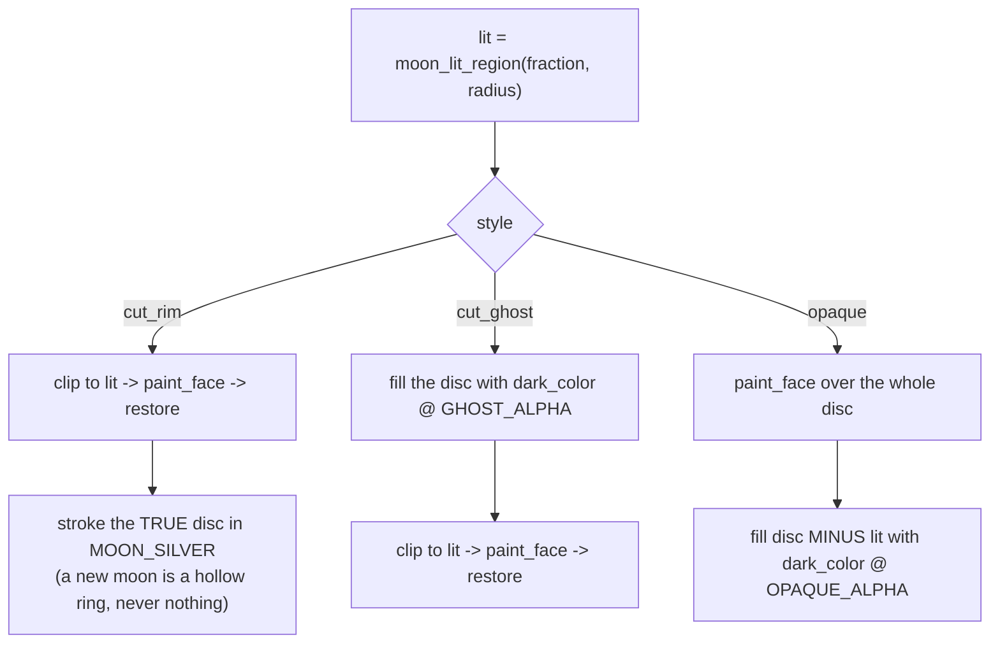

# Moon Face — Flow

**About:** [description](../__about/moon_face.md)

## The three unlit-half treatments (`draw_moon_disc`)

The order matters and is the reason the module owns `paint_face`: the
two cut styles must install the clip BEFORE the face is painted, while
`opaque` paints the face first and covers it after.

## The umbra sweep (`draw_umbra_sweep`)

    FUNCTION draw_umbra_sweep(painter, radius, state, magnitude):
        clip to the moon disc                      # the shadow never spills past the limb
        travel = (1 - magnitude) * SWEEP_TRAVEL * radius
        shadow = circle(centre = (travel, -travel * SWEEP_RISE),
                        radius = radius * SWEEP_RADIUS)
        fill shadow with:
            penumbral -> a neutral wash            # real penumbral eclipses barely show
            partial / total -> the copper umbra
        IF ECLIPSE_STATE_FRINGE[state]:
            stroke the same circle in the turquoise ozone colour
        restore

Magnitude 1.0 puts the shadow circle concentric with the disc (full
copper face); magnitude 0 walks it clear off the limb. The catalogue
number is therefore VISIBLE GEOMETRY, which is the whole point of the
style — the shipped `halo` style dims the whole disc uniformly and
shows nothing moving.
