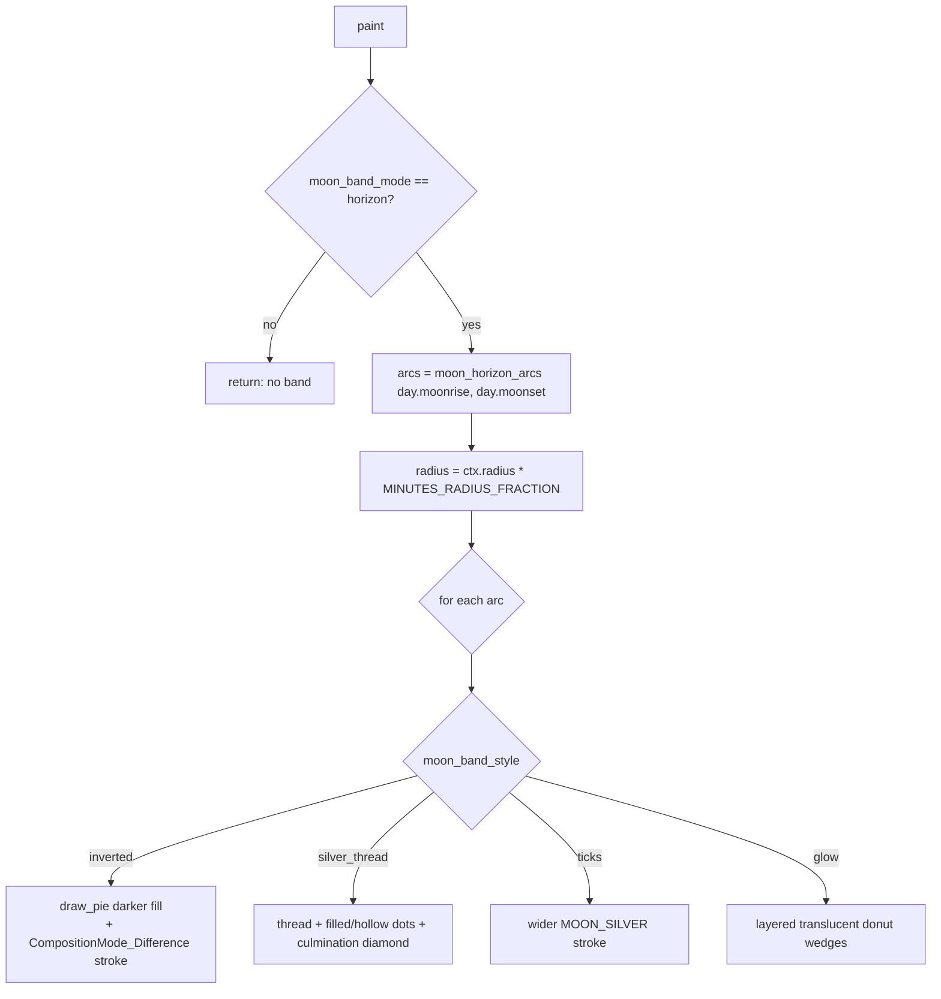

# Moon Band Layer — Flow

**About:** [description](../__about/moon_band.md)

## Algorithm

```mermaid
flowchart TB
    A[paint] --> B{moon_band_mode == horizon?}
    B -- no --> Z[return: no band]
    B -- yes --> C[arcs = moon_horizon_arcs day.moonrise, day.moonset]
    C --> D[radius = ctx.radius * MINUTES_RADIUS_FRACTION]
    D --> E{for each arc}
    E --> F{moon_band_style}
    F -- inverted --> G[draw_pie darker fill\n+ CompositionMode_Difference stroke]
    F -- silver_thread --> H[thread + filled/hollow dots + culmination diamond]
    F -- ticks --> I[wider MOON_SILVER stroke]
    F -- glow --> J[layered translucent donut wedges]
```
