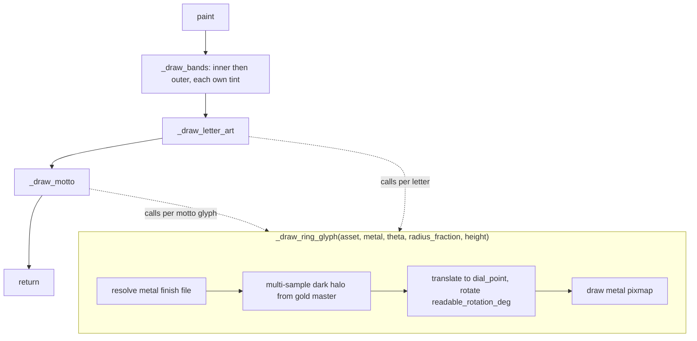

# Ring Layer — Flow

**About:** [description](../__about/ring.md)

## Algorithm

Pseudocode (language-neutral): THE COMPOSITIONAL RING MODEL (owner
decree 2026-08-05) — always both bands, never a single plate:

    _draw_bands():
        draw inner_asset tinted (ring_tint_inner, follows ring_tint if None) + saturated, full size
        draw outer_asset tinted (ring_tint) + saturated, full size, ON TOP
    _draw_letter_art()      # per-hour letters, untinted (unless letter_tint set)
    _draw_motto()           # top/bottom Crown Text arcs, untinted (unless motto_tint set)

    FUNCTION _draw_ring_glyph(gold_asset, metal, theta, radius_fraction, height):
        asset = letter_metal_file(gold_asset, metal)     # derived, disk-cached
        rotation = readable_rotation_deg(theta)           # flips upright below center
        translate to dial_point(theta, radius * radius_fraction); rotate
        FOR EACH of N halo samples around a small radius:
            draw the gold-tinted shadow silhouette, low opacity
        draw the metal-finish pixmap centered, full opacity

    FUNCTION _draw_letter_art():
        FOR EACH (hour, gold_asset) IN skin's letter_art:
            _draw_ring_glyph(..., height * letter_zoom[hour])

    FUNCTION _draw_motto():
        IF skin has no motto texts: RETURN
        FOR EACH motto IN skin's mottos:
            FOR EACH (gold_asset, theta) IN motto's glyphs:
                _draw_ring_glyph(..., dial.RING_MOTTO_RADIUS_FRACTION, height)
