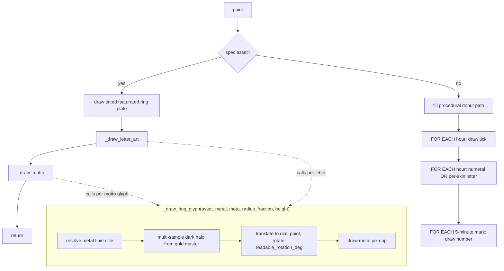

# Ring Layer — Flow

**About:** [description](../__about/ring.md)

## Algorithm

Pseudocode (language-neutral):

    IF ring has an art asset:
        draw tinted (ring_tint) + saturated (ring_saturation) plate, full size
        _draw_letter_art()      # per-hour letters, untinted
        _draw_motto()           # top/bottom Great Seal arcs, untinted
        RETURN

    fill the donut path (outer minus inner ellipse) with spec.fill
    FOR EACH hour IN 0..23:
        draw a tick line at that hour's angle
    FOR EACH hour IN 0..23:
        IF a per-skin letter is defined for this hour:
            draw the letter, letter color/font
        ELSE:
            draw the plain numeral, text color/font
    FOR EACH minute IN (5, 10, ..., 55):
        draw the minute number along the inner edge

    FUNCTION _draw_ring_glyph(gold_asset, metal, theta, radius_fraction, height):
        asset = letter_metal_file(gold_asset, metal)     # derived, disk-cached
        rotation = readable_rotation_deg(theta)           # flips upright below center
        translate to dial_point(theta, radius * radius_fraction); rotate
        FOR EACH of N halo samples around a small radius:
            draw the gold-tinted shadow silhouette, low opacity
        draw the metal-finish pixmap centered, full opacity

    FUNCTION _draw_letter_art():
        FOR EACH (hour, gold_asset) IN skin's letter_art:
            _draw_ring_glyph(..., height * letter_zoom[hour])

    FUNCTION _draw_motto():
        IF skin has no motto texts: RETURN
        FOR EACH motto IN skin's mottos:
            FOR EACH (gold_asset, theta) IN motto's glyphs:
                _draw_ring_glyph(..., dial.RING_MOTTO_RADIUS_FRACTION, height)
